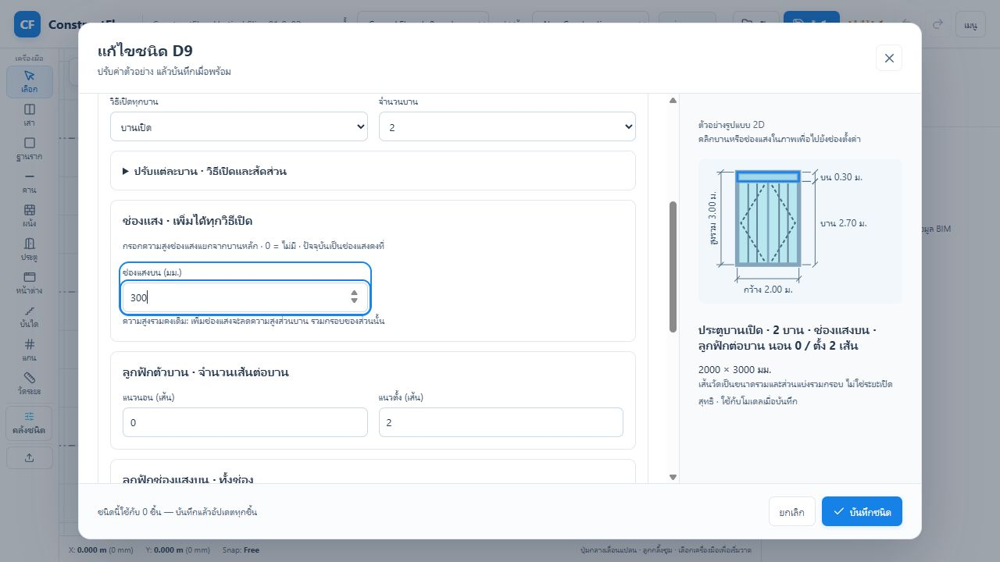

# ConstructFlow — Door, Window & Opening Builder

วันที่: 2026-10-08  
สถานะ: **ปรับ editor รอบแรกแล้ว; ระบบส่วนประกอบเต็มยังอยู่ในแผน**  
เชื่อมกับ [แผนวัสดุและกระจก](GLASS-MATERIALS-UX-PLAN-2026-10-08.md) และ [แผนคลังชนิด](UX-CATALOG-MENUS-PLAN-2026-10-08.md)

## 1. ปัญหาที่ตรวจจาก code และภาพผู้ใช้

`TypeManagerModal.tsx` มีปุ่ม “บานเปิด”, “บานเลื่อน”, “เลื่อน + ช่องแสง”, “เปิด + ลูกฟัก” ที่แทนค่าหลายอย่างในครั้งเดียว: วิธีเปิด, จำนวนบาน, layout, สัดส่วนบาน, ความสูงช่องแสงบน/ล่าง และจำนวนลูกฟัก การกด “บานเปิด” จึงตั้งช่องแสงกลับเป็น 0 และลูกฟักกลับเป็น 1 ช่อง ทั้งที่ผู้ใช้ต้องการเปลี่ยนวิธีเปิดเท่านั้น

อีกชุดชื่อ “รูปแบบตั้งต้น” จริง ๆ คือวิธีเปิดของทุกบาน ไม่ใช่ preset ของ assembly ทั้งชุด คำเรียกซ้อนกันทำให้เข้าใจว่าบานเปิดกับช่องแสงเลือกได้อย่างใดอย่างหนึ่ง ทั้งที่ fields ความสูงช่องแสงมีอยู่แล้วและไม่ได้ขึ้นกับวิธีเปิด

Preview เดิมระบุแค่ W×H ใต้ภาพ ไม่มีเส้นบอกว่า H รวมช่องแสงหรือเป็นความสูงบาน และจำกัดช่องแสงในภาพที่ 38% แม้ parameter จริงสูงกว่านั้น

## 2. วิธีของ Archicad ที่ตรวจจากเอกสารผู้ผลิต

เอกสาร Archicad 29 INT Library มีหลักการที่นำมาปรับใช้ได้ โดยตัวเลือกจริงขึ้นกับ library part และรุ่น library:

- **ภาพรวมก่อนรายละเอียด**: หน้าตั้งค่าหลักรวมค่าที่ใช้บ่อย และมีทางไปหน้ารายละเอียดของ Leaf/Frame/Opening ต่างหาก ([Door/Window Settings and Opening](https://help.graphisoft.com/AC/29/INT/_AC29_Help/151_DoorWindowCustomSettings/151_DoorWindowCustomSettings-4.htm))
- **เลือกส่วนที่จะปรับ**: Sash Type ให้เลือก sash หรือ transom ก่อน ตั้ง Uniform Sashes เพื่อใช้แบบเดียวกันได้; grid มีจำนวนช่องและตำแหน่งแบ่ง และบางรูปแบบแก้ทางกราฟิกผ่าน hotspots ได้ ([Sash Type/Sash Options](https://help.graphisoft.com/AC/29/INT/_AC29_Help/151_DoorWindowCustomSettings/151_DoorWindowCustomSettings-10.htm))
- **วิธีเปิดแยกตามองค์ประกอบ**: บานหลัก ช่องข้าง และช่องบนมีวิธีเปิด/มุมหรือระยะเปิดของตนเอง ไม่ตีความ transom ว่าต้องเป็นช่องแสงคงที่เสมอ ([Opening Type and Angle](https://help.graphisoft.com/AC/29/INT/_AC29_Help/151_DoorWindowCustomSettings/151_DoorWindowCustomSettings-13.htm))
- **Dimension มีชนิดขนาดที่ชัดเจน**: wallhole, unit, reveal, egress และ leaf sizes ต่างกัน; nominal size และ hotspots ต้องใช้การคำนวณที่สอดคล้องกัน การใส่ตัวเลข W×H อย่างเดียวจึงไม่พอ ([Nominal sizes – Automatic dimensioning](https://gdl.graphisoft.com/tips-and-tricks/nominal-sizes-automatic-dimensioning/))
- **ช่องว่างเปล่ามีความหมายของตัวเอง**: Door/Window tool เลือก Empty Opening ได้; ConstructFlow ควรมี contract ของช่องเปิดเปล่า ไม่จำลองด้วยประตูโปร่งใส ([Doors/Windows](https://help.graphisoft.com/AC/29/INT/_AC29_Help/040_ElementsVB/040_ElementsVB-305.htm))

ข้อเสนอ ConstructFlow: ใช้หลักภาพรวม + เลือกส่วน + แก้อิสระ + รายละเอียดเปิดเมื่อจำเป็น แทนการคัดลอกทุกหน้าตั้งค่าของ Archicad

## 3. สิ่งที่ปรับแล้วในรอบนี้

1. เอาปุ่มชุดเดิมที่แทนค่าหลาย field ออก เปลี่ยนหัวข้อเป็น **บานหลัก** และ selector **วิธีเปิดทุกบาน**
2. เปลี่ยนวิธีเปิดรักษาจำนวนบาน สัดส่วนกว้าง ความสูงช่องแสง และลูกฟักเดิม; หากแต่ละบานต่างวิธีเปิด selector แสดง “กำหนดต่างกันรายบาน”
3. รายละเอียดรายบานอยู่ใน disclosure **ปรับแต่ละบาน · วิธีเปิดและสัดส่วน** ลดช่องที่เห็นครั้งแรก คลิกบานใน preview จะเปิดรายละเอียดและ focus บานนั้น
4. ช่องแสงอยู่กลุ่มอิสระ **เพิ่มได้ทุกวิธีเปิด**: บนทั้งประตูและหน้าต่าง; ล่างสำหรับหน้าต่างตาม contract ปัจจุบัน แสดงชัดว่าปัจจุบันเป็นช่องแสงคงที่
5. Preview ของ editor มี dimension กว้าง/สูงรวม/ช่องบน/ส่วนบาน/ช่องล่าง อัปเดตตาม draft แสดงเมตร 2–3 ทศนิยม พร้อม metadata mm; thumbnail ในคลังยังเล็กและไม่แสดง dimension เต็ม
6. การคลิกส่วนใน SVG และ Enter/Space เลือกบานหรือช่องแสงได้ ไฮไลต์และไปยัง field ที่เกี่ยวข้อง การเลือกบานเพื่อปรับวิธีเปิดเป็นรายบานได้ แต่ลูกฟักบานหลักยังใช้ร่วมกันทุกบาน
7. สูตรความสูงอยู่ใน pure helper `measureOpeningRegions` ใน architecture-engine ไม่วางสูตรโดเมนใน container React; invalid draft ไม่แสดงภาพวัดค่าที่ถูก clamp ให้เข้าใจผิด

### ความหมายของเส้นวัดรอบแรก

`H รวม = H ช่องบน + H ส่วนบาน + H ช่องล่าง`

เช่น D9 กว้าง 2.00 ม., สูงรวม 3.00 ม., ช่องบน 0.30 ม. → ส่วนบาน 2.70 ม. ขนาดส่วนบานนี้ **รวมกรอบของส่วนนั้น** ไม่ใช่ขนาดใบประตูจริงหรือความสูงผ่านสุทธิ ห้ามนำป้ายนี้ไปแทนข้อมูลผลิตหรือ egress clearance

การแก้ช่องบนในโหมดปัจจุบันรักษา H รวม จึงลด/เพิ่ม H ส่วนบาน; กรอก 0 เพื่อเอาช่องนั้นออก ลูกฟักของช่องเก็บแยกไว้ตาม contract เดิม การเพิ่มความสูงรวมเพื่อรักษาบานสูงเท่าเดิมยังเป็นงานของโหมดล็อกความสูงในแผนถัดไป



## 4. Flow เต็มที่เสนอ

### ขั้นแรก: เลือกรูปแบบเริ่มต้นจากคลัง

รูปแบบเริ่มต้นเป็น assembly preset สำหรับสร้าง/clone ชนิด เช่น เปิดเดี่ยว, เปิดคู่, เลื่อน 2/3/4 บาน, กระทุ้ง, เกล็ด, fixed, เปิดคู่มีช่องบน, เลื่อนมีช่องบน/ล่าง, ช่องเปิดเปล่า เลือกแล้วแก้ต่อได้; preset ไม่ใช้เป็น selector ที่บังคับ configuration ระหว่างแก้

### หน้าตั้งค่าหลัก: สามเรื่องที่ใช้บ่อย

- **ขนาด**: กว้างรวม, สูงรวม, ระดับธรณี/ขอบล่างตามงาน และโหมด “คงสูงรวม” / “คงสูงบานหลัก”
- **บานหลัก**: จำนวนบาน, วิธีเปิดร่วม, รายละเอียดรายบานเมื่อจำเป็น
- **ส่วนเสริม**: เปิด/ปิดช่องบน, ช่องล่าง, ช่องข้างซ้าย/ขวา; ความสูง/ความกว้างและวิธีเปิดของส่วนที่เพิ่ม

ตัวอย่าง: เลือกเปิดคู่ → เพิ่มช่องบน 0.30 ม. → เปลี่ยนช่องบนเป็นกระทุ้ง → ใส่ลูกฟักเฉพาะช่องบน → บันทึกชนิด ไม่ต้องสลับไป preset “เลื่อน + ช่องแสง” เพื่อให้มีช่องบน

### คลิกส่วนในภาพ แล้วแสดงรายละเอียดส่วนนั้น

ส่วนที่เลือกควรมีแผงรายละเอียดเดียว แทนเรียง field ทุกบานและช่องแสงยาวทั้งหมด:

```text
[ขนาดรวม]  [บานหลัก]  [ส่วนเสริม]

ภาพรูปด้านมี dimension          กำลังแก้: ช่องบน
  คลิกบาน / ช่องบน / ช่องข้าง    วิธีเปิด: [กระทุ้ง]
                                 สูง:     [0.30 ม.]
                                 ลูกฟัก:  [ไม่มี]
                                 วัสดุ:   [ใช้สเปกเดียวกับบานหลัก]
                                 ▸ รายละเอียดกรอบ/กระจก/การเปิด
```

“ใช้ค่าเดียวกันทุกบาน” เป็นค่าเริ่มต้นสำหรับลูกฟัก/วัสดุ; ยกเลิกจึงปรับแยก การแก้เฉพาะช่องบนไม่เปลี่ยนบานหลัก มุม/ระยะเปิด 2D และ 3D ต้องเป็นค่าที่ตั้งได้ ไม่ hardcode มุมภาพเป็นความหมายของชนิด

## 5. Dimension และส่วนประกอบที่ยังต้องพัฒนา

| เรื่อง | ข้อมูลและพฤติกรรมที่ต้องเพิ่ม | สถานะ |
|---|---|---|
| dimension ใน editor | nominal W/H + region chain | ทำแล้วในรอบนี้ |
| click-to-select | เลือกบาน/ช่องบน/ช่องล่างแล้ว focus field | ทำแล้ว; ยังไม่ได้เป็นแผง detail เดียว |
| ช่องบน/ล่างเปิดได้ | `transom_operation` / `bottom_light_operation`, ทิศ/มุม/ระยะเปิดตามความสามารถของส่วน; geometry, symbol, validation, command และ migration ครบ | ยังไม่มีใน contract ปัจจุบัน |
| ช่องข้าง | กว้าง, height/layout, วิธีเปิด, วัสดุ/grid, geometry ส่วนซ้าย/ขวา | ยังไม่มีใน builder |
| ล็อก H รวม/H บาน | domain solver เปลี่ยนความสูงชุดหรือบานตามโหมด โดยรวม framing อย่างชัดเจน | ยังไม่มี |
| dimension แบบผลิต | แยก wall opening, outer frame, actual sash, clear opening, net glass; tolerance/rebate/frame profile เป็น input ของ domain | ยังไม่มีใน editor นี้ |
| dimension รายบาน | รวมกรอบ/สุทธิ ตามโหมด แสดงความกว้างต่างกันด้วย chain และแก้ค่าตรงบนภาพ | ยังไม่มี; ปัจจุบันปรับผ่านสัดส่วน |
| grid รายบานและระยะกำหนดเอง | shared default + override รายบาน, nonuniform positions, bar type dividing/decorative | ยังไม่มี; ปัจจุบันแบ่งเท่ากันและบานหลักใช้ grid ร่วม |
| วัสดุส่วนต่าง ๆ | shared glass spec และ region assignments ตามแผนวัสดุ | ยังเป็นแผน |
| ช่องเปิดเปล่า | object type/commands/type catalog/host cutout/undo/phasing/takeoff; ไม่ใช่ door/window ที่ซ่อน mesh | ยังไม่มี dedicated contract ที่พบจากการค้น source |
| dimension ใน schedule/sheet | ใช้ resolved measurement เดียวกับ 3D พร้อมขนาดที่เลือกและ scale-aware annotations | ยังไม่ได้ทำในรอบนี้ |

## 6. ลำดับพัฒนาและข้อกำหนดโดเมน

1. **รอบที่ทำแล้ว**: แก้ control ที่ทับค่า, dimension editor, click-to-focus โดยใช้ fields/CommandBus เดิม
2. **รอบต่อไป**: รวมแผนวัสดุ A–B กับแผงรายละเอียดตามส่วนและ typed component contract รองรับช่องแสงเปิดได้ ขยาย representation และ geometry พร้อมกัน ไม่ใส่ dropdown ที่ mesh ยังทำไม่ได้
3. **รอบถัดมา**: ช่องข้าง + height-lock solver + per-leaf grid/material override; layout ต้องเก็บ persistent component identity เมื่อเพิ่ม/ลดส่วน ไม่เอา index บานเป็น UUID ของ project entity
4. **รายละเอียดงานผลิต/เอกสาร**: nominal/clear/sash sizes, tolerance/rebate, mullion vs decorative strips, hardware, empty openings, glass takeoff และ schedules

สูตร/geometry/validation อยู่ใน architecture-engine และ shared representation; UI มีหน้าที่แสดงและจัด draft เท่านั้น Typed parameters/commands และ migration ต้องทำพร้อม features ใหม่ การบันทึกผ่าน transaction รักษา type cascade, instance overrides, host UUID, created_phase และ Undo/Redo ตาม AGENTS.md

ก่อนเพิ่ม field ให้กำหนด semantics ของขนาดส่วนให้ตรงกันใน catalog, 3D และ sheet ห้ามใช้การ clamp เงียบ ๆ เพื่อแก้ configuration ที่ไม่มีพื้นที่สำหรับกรอบบาน

## 7. Verification ของรอบที่ทำแล้ว

- architecture-engine build และ tests **9/9 ผ่าน** รวม regression ใหม่ 2 cases: height partition/tall transom และ invalid drafts
- plan-editor `npm run build` ผ่าน TypeScript/Vite; bundle warning >500 kB เดิมยังมี
- Browser D9: 2000×3000 มม. + ช่องบน 300 มม. → main 2700 มม.; เปลี่ยน sliding → hinged ยังมี 2 บาน, ช่องบน และลูกฟักเดิม
- Enter เลือกบาน 2 เปิด disclosure และ focus วิธีเปิดบาน 2; เปลี่ยนเป็น sliding แล้ว save/reopen พบ “กำหนดต่างกันรายบาน”
- ช่องบนสูงเท่า H รวม: domain command ปฏิเสธบันทึกและข้อความ error ชี้ขนาดช่องแสง; คืน 300 มม. บันทึกได้
- Browser W10: 1800×1800 มม. → บน 300, main 1200, ล่าง 300; คลิกช่องล่าง focus field ถูกต้อง
- Layout: 2548×913 footer bottom 865.5; 1280×600 footer bottom 575 และ preview อยู่ใน stage; คืน viewport หลังตรวจ
- ภาพ proof บันทึกและตรวจไฟล์เต็มแล้ว ไม่บันทึกโครงการทดสอบลงไฟล์ของผู้ใช้

ไฟล์แก้รอบนี้: `apps/plan-editor/src/components/catalogPresentation.tsx`, `apps/plan-editor/src/components/TypeManagerModal.tsx`, `apps/plan-editor/src/app.css`, `packages/architecture-engine/src/index.ts`; สร้าง `packages/architecture-engine/src/openingDimensions.ts`, `packages/architecture-engine/test/opening-dimensions.test.mjs`, เอกสารนี้ และภาพ proof; เพิ่มลิงก์/สถานะใน UX catalog plan

ไม่ได้แก้ `types.ts`, project schema หรือ command-schema ในรอบนี้ เพราะใช้ parameter และ transaction เดิม ไม่มีการเปลี่ยน UUID, phasing หรือสูตร BOQ; ไม่อ้างว่าระบบ builder เต็มหรือวัสดุกระจกเสร็จแล้ว

## 8. รูปแบบหน้าบานและฮาร์ดแวร์ที่เลือกได้

เพิ่ม optional type-catalog parameters เพื่อให้เลือก **ลายบานทึบ**, **รูปแบบมือจับ**, และ **สี/ผิวโลหะ** แยกจากวิธีเปิด, จำนวนเส้นลูกฟัก, วัสดุบาน, วงกบ และสเปกกระจก รูปแบบหน้าบานที่มีตอนนี้: เรียบ, ลูกฟัก 2/4/6 ช่อง, เซาะร่องแนวนอน 3/5 เส้น, เซาะร่องแนวตั้ง 3 เส้น และเกล็ด; มือจับ: ก้านโยก, ลูกบิด, ก้านดึง, มือจับฝัง และไม่แสดง; ผิวโลหะ: เงิน/สเตนเลส, ดำด้าน, ทองเหลืองซาติน และบรอนซ์

หน้าตั้งชนิดแยกหัวข้อ “หน้าบานและมือจับ” จาก “วัสดุ” และ “ลูกฟัก/กระจก” เพื่อไม่ให้จำนวนเส้นลูกฟักถูกเข้าใจเป็นลายเซาะร่อง วัสดุบานทึบแยกจากลาย ขณะที่วัสดุกระจกใช้ตัวเลือกของเดิม 2D preview แสดงลาย/ตำแหน่งมือจับและสีโดยประมาณ และ 3D สร้าง relief/ร่อง/เกล็ดกับชิ้นส่วนมือจับ; ตำแหน่งมือจับของบานคู่เกาะริมชนกันของบาน และประตู/หน้าต่างกระจกมีสัญลักษณ์มือจับใน preview ด้วย

รูปแบบที่ตรวจจากสินค้าตลาดไทยยืนยันว่าควรแยก “ลาย” กับ “วัสดุ/ฮาร์ดแวร์”: ตัวอย่าง [บาน HDF LINEA05 เซาะร่อง](https://www.homepro.co.th/p/1242154) และ [บาน HDF ลูกฟัก 4 ช่อง](https://www.homepro.co.th/p/1086231); ฮาร์ดแวร์มีทั้ง [ชุดมือจับก้านโยก](https://www.homepro.co.th/p/264735?lang=th) และ [มือจับแบบดึง/ฝังสำหรับบานเลื่อน](https://www.homepro.co.th/p/271556) โดยบางบานจำหน่ายแยกจากมือจับ/ยังไม่เจาะรู

**ขอบเขตความแม่นยำ:** รูปแบบเหล่านี้เป็นพารามิเตอร์สำหรับออกแบบและแสดงผล ไม่ใช่ SKU/รุ่นการผลิต ไม่ระบุยี่ห้อ, ขนาดจริงของมือจับ, รูเจาะ/ระยะ backset, ไส้กุญแจ, บานพับ, lockset, tolerance หรือข้อกำหนดการติดตั้ง; ต้องทำ vendor product library แยก หากจะออก schedule จัดซื้อหรือผลิตจริง การคงค่าเป็น optional และมี fallback รักษาการอ่านไฟล์โครงการเดิม

### เหลืองานต่อ

- ทำ hardware specification แบบระบบ lockset/บานพับ/ระยะเจาะ พร้อมการกรองอุปกรณ์ตามชนิดเปิดและความหนาบาน
- สร้างคลังรุ่นสินค้าผู้ผลิตและตรวจขนาดตามแค็ตตาล็อก/เอกสารผู้ผลิต โดยแสดงแบรนด์/รุ่น/ขนาดเมื่อเลือก SKU จริง
- เพิ่มแผงมือจับและอุปกรณ์เป็น geometry ที่แม่นกับชนิดบานเปิด, บานกระทุ้ง, มือจับเซาะฝังตามโปรไฟล์ และวัสดุวงกบ
- เพิ่มมุม/ระยะ zoom ของ preview เพื่อแยก finish ที่ใกล้กันและตรวจรูเจาะ/ตำแหน่ง

## 9. Delivery — แกลเลอรีแบบและรายละเอียดโมเดล (2026-10-08)

- เพิ่มแบบตั้งต้น 16 ชุด: ประตูไม้เรียบ, ร่องนอน, ร่องตั้ง, คลาสสิกสองลูกฟัก, คู่หกลูกฟัก, เฟรนช์กระจกคู่, เลื่อนสามบาน และบานเกล็ดไม้; หน้าต่างเลื่อน, กระจกภาพวิว, คอตเทจ, กรอบไม้ช่องบน, กระทุ้งฝ้า, บานผสมสามส่วน, กริดติดตาย และเลื่อนพร้อมช่องบน/ล่าง
- เปิดจากคลังประตู/หน้าต่าง → แบบสำเร็จรูป · เลือกสไตล์ มีตัวกรองสี่สไตล์และค้นหา เลือกแล้วเข้า draft ปรับก่อนสร้างชนิดผ่าน CommandBus; รองรับโครงการเก่าและตั้งรหัสต่อท้ายเมื่อซ้ำ
- โมเดลบานทึบมีลูกฟักนูนพร้อมคิ้วสองชั้นทั้งสองหน้า ร่องบางและแผ่นเกล็ดเอียง; ขอบกระจกมี glazing beads; สีวัสดุ preview/3D ใช้ palette เดียวกัน ปรับ roughness/metalness ตามวัสดุ
- แก้รายละเอียดบานเลื่อนให้ตามระยะ track และมือจับหน้าต่างให้เป็นส่วนของ sash ที่เคลื่อนที่
- Geometry helpers อยู่ representation-engine; presets อยู่ project-model; UI จัด draft และ render ข้อมูล ไม่เพิ่ม schema/command fields หรือเปลี่ยน UUID/phasing/Undo contracts
- Verification: command tests 4/4 (รวมวนสร้างทั้ง 16 designs, serialize/reopen, Undo และ transaction tests เดิม); representation tests 9/9; TypeScript/Vite build ผ่าน มี bundle warning >500 kB เดิม
- Browser: ตรวจคลังที่ขนาดแคบและ 1280×800, กรองหน้าต่างคลาสสิก, สร้าง D-C01, assign ให้ประตูเดิมและเปิด 3D ได้โดยไม่มี console errors
- งานต่อ: preview 3D ใน editor, SKU, สเปกผลิต, วัสดุแยก region, ช่องแสงเปิดได้และช่องข้างยังอยู่ในแผน

ไฟล์หลัก: `packages/project-model/src/openingDesigns.ts`, `packages/representation-engine/src/openingDetails.ts`, `apps/plan-editor/src/components/TypeManagerModal.tsx`, `apps/plan-editor/src/components/catalogPresentation.tsx`, `apps/plan-editor/src/components/Model3DViewport.tsx`, `apps/plan-editor/src/app.css`; tests: `packages/command-runtime/test/opening-designs.test.mjs`, `packages/representation-engine/test/opening-details.test.mjs`.

## 10. Delivery — ระบบประกอบลายหน้าบานและฮาร์ดแวร์ (2026-10-08)

ภาพอ้างอิงชุดนี้ทำให้แยกความหมายของ “ลายบาน” ออกจากจำนวนลูกฟักได้ชัดเจน จึงเพิ่ม component recipe ที่เก็บตำแหน่งเป็นสัดส่วน 0–1 ภายในใบบาน แต่ละ component มี UUID ของตัวเอง ประเภท panel/grooves, contour rectangle/arch/capsule/ellipse และจำนวนเส้น/ทิศทางสำหรับร่อง

- ชุดลายที่เลือกได้ใน editor: กระดานนอน 8/14 เส้น, ร่องตั้งเต็มบาน/ในกรอบ, ร่องผสม, คลาสสิกสามส่วน, โค้งบน, แคปซูล, วงรี, วงกลมกลาง, ห้าลูกฟัก และกรอบสูงเต็มบาน
- เลือกชุดลายแล้ว 2D preview แสดงตำแหน่งจริงตามสัดส่วนบาน และ 3D วางร่อง/คิ้ว/แผ่นลายบนทั้งสองหน้าของใบบาน ทุก component ถูกตรวจให้อยู่ในกรอบก่อนบันทึก
- มือจับ 3D เพิ่มแป้นฐาน/rose, คอจับ, ก้านโยกหรือหัวลูกบิด, จุดยึดมือจับก้านดึง, ร่องมือจับฝัง และกระบอกล็อกแยกจากตัวมือจับ สี/ผิวโลหะเดิมยังใช้ร่วมกัน
- Component recipes เป็น design geometry สำหรับปรับแบบและการนำเสนอ ยังไม่ใช่ profile โรงงาน; ระยะคิ้ว, ร่อง, รูเจาะ, backset, lockset และ tolerance ต้องอยู่ใน vendor/product contract รอบ SKU

ผลตรวจ: project-model 16/16, representation-engine 9/9, command-runtime opening/design tests 4/4 และ plan-editor TypeScript/Vite build ผ่าน (bundle warning เดิมยังอยู่). Browser ตรวจ editor จริง พบชุดลาย 12 แบบ, preview วงรี/โค้ง และการเปิดตัวเลือกผ่าน keyboard/DOM state

ไฟล์เพิ่ม: `packages/project-model/src/doorFace.ts`, `packages/project-model/src/doorFaceDesigns.ts`, `packages/project-model/test/door-face.test.mjs`; ภาพ: `docs/assets/opening-designs-2026-10-08/door-face-editor.jpg`.
