# ConstructFlow Development Roadmap

This is the active product roadmap under [ADR-0006](decisions/ADR-0006-standalone-first-engine.md). ConstructFlow owns the canonical `.cfproj` document, native computation, 2D/3D workbench, takeoff and sheet compilation. External CAD/BIM tools are optional downstream adapters.

> **Plan-driven modeling first: draw and edit the semantic model in plan, see 3D update immediately, and keep schedules, quantities and documents attached to the same Smart Objects.**

The detailed rationale and upgrade tracks are defined in [`PLAN-DRIVEN-MODELING-UPGRADE.md`](./PLAN-DRIVEN-MODELING-UPGRADE.md).

Standalone engine delivery uses S0–S5 from [`STANDALONE-ENGINE-REVIEW-2026-10.md`](STANDALONE-ENGINE-REVIEW-2026-10.md): S0 schema/history supports R0/R3; S1 takeoff supports R9; S2 native 3D/assemblies supports R1/R2/R4/R6; S3 spatial/MEP/rule inputs supports R7/QA; S4 sheets supports R5/R9; S5 adapters/MCP supports interoperability/R10. These are cross-cutting engine milestones, not a second competing product roadmap.

## Roadmap policy

ConstructFlow is not attempting full Revit parity. Revit is used only as a baseline for the modeling behaviors that make everyday architectural work fast and coherent: plan-driven creation, hosted elements, joins, levels, type/instance parameters, constraints, schedules and associative documents.

ConstructFlow should remain optimized for residential renovation, extension and small-building production, with differentiated workflows in drainage, paving, joinery, BOQ and construction automation.

The roadmap now favors **depth of editing behavior over breadth of object inventory**. A smaller number of objects that can be drawn, stretched, hosted, joined, parameterized and documented reliably is more valuable than a large registry of shallow generators.

---

## Master Construction Engineering Roadmap (6 Pillars)

แผนงานวิศวกรรมและการพัฒนาระบบก่อสร้าง 6 เสาหลักของ ConstructFlow (อ้างอิงกฎกระทรวงฉบับที่ 55, ข้อบัญญัติ กทม., มาตรฐาน วสท., กรมบัญชีกลาง, และแบบขออนุญาต อ.1 20 แผ่น):

```mermaid
flowchart TD
    subgraph Pillar1["🏛️ เสาที่ 1: งานสำรวจ ที่ดิน และกฎหมายอาคารไทย (เสร็จสมบูรณ์)"]
        P1_1["1.1 ระยะร่นแนวชายคาหลังคา (Roof Eaves Setback ข้อ 50) ✅"]
        P1_2["1.2 ความกว้างถนนสาธารณะกับความสูงอาคาร (ข้อ 44) ✅"]
        P1_3["1.3 ระยะร่นแหล่งน้ำสาธารณะ (ข้อ 42) ✅"]
        P1_4["1.4 ระดับดินถม vs ระดับกึ่งกลางถนน (พ.ร.บ. ขุดดินถมดิน & ข้อบัญญัติ กทม.) ✅"]
    end

    subgraph Pillar2["🏗️ เสาที่ 2: วิศวกรรมโครงสร้างและฐานราก (เสร็จสมบูรณ์)"]
        P2_1["2.1 ฐานรากตีนเป็ดชิดเขต (Strap Footing) & คานดึงรั้ง (Strap Beam) ✅"]
        P2_2["2.2 คานยาว 7 ม. 25x60 ซม. พร้อมเหล็กข้างคาน (Side Skin) & เสากลาง ✅"]
        P2_3["2.3 รายละเอียดดัด/ตัดเหล็กคาน 3 ตอน (L-Section & วสท. 1-1, 2-2, 3-3) ✅"]
        P2_4["2.4 คานยื่น (Cantilever) เหล็กรับแรงดึงบน & ตารางขยายเสา-คาน S-05/S-06 ✅"]
    end

    subgraph Pillar3["🧱 เสาที่ 3: งานสถาปัตยกรรมและเปลือกอาคาร (เสร็จสมบูรณ์)"]
        P3_1["3.1 เสาเอ็นและทับหลัง คสล. (Lintels & Stiffeners บนแบบขยาย A-08) ✅"]
        P3_2["3.2 รอยต่อกันซึมหลังคาชนผนังเดิม (Flashing & PU Sealant บน A-09) ✅"]
        P3_3["3.3 ธรณีกันน้ำ (Shower Curb) และสโลปพื้นห้องน้ำ 1:50 บน A-09 ✅"]
        P3_4["3.4 ปริมาณและระดับกรุกระเบื้องผนังห้องน้ำ (Wall Tile Finish Takeoff) ✅"]
    end

    subgraph Pillar4["💧 เสาที่ 4: งานระบบสุขาภิบาลและไฟฟ้า (MEP) (เสร็จสมบูรณ์)"]
        P4_1["4.1 ระบบประปาน้ำดี ถังพักน้ำ ปั๊มน้ำ & 3-Valve Bypass บน M-01 ✅"]
        P4_2["4.2 ช่องเปิดล้างท่อ Cleanout (FCO/WCO) & ท่อระบายอากาศ (Vent Stack) บน M-02 ✅"]
        P4_3["4.3 ถังบำบัดน้ำเสีย (Septic Tank) & ถังดักไขมัน (Grease Trap) บน M-02 ✅"]
        P4_4["4.4 สัญลักษณ์/ระดับติดตั้ง E-01 & ระบบหลักดิน (Ground Rod) + RCBO 30mA บน E-02 ✅"]
    end

    subgraph Pillar5["💰 เสาที่ 5: งานประมาณราคาและ BOQ (Cost Engineering)"]
        P5_1["5.1 ตัวคูณเผื่อเศษวัสดุ (Waste Factor: กระเบื้อง, ปูน, เหล็กเส้น)"]
        P5_2["5.2 ไม้แบบและการคิดรอบการใช้ซ้ำ (Formwork Reuse Factor)"]
        P5_3["5.3 หมวดงานเตรียมการและงานชั่วคราว (Preliminaries: Shoring, นั่งร้าน)"]
        P5_4["5.4 สรุป Factor F และภาษีมูลค่าเพิ่ม 7% (Gov Standard)"]
    end

    subgraph Pillar6["📐 เสาที่ 6: การประสานมิติแบบก่อสร้าง (BIM Coordination)"]
        P6_1["6.1 Hard Clash ท่อสโลป 1:100 ลอดใต้คาน คสล. ชนระดับฝ้า"]
        P6_2["6.2 Soft Clash วงสวิงบานประตูชนสุขภัณฑ์และอุปกรณ์"]
        P6_3["6.3 แบบขยาย Detail มาตรฐานงานต่อเติมและรอยต่อวัสดุ"]
    end

    Pillar1 --> Pillar2
    Pillar2 --> Pillar3
    Pillar3 --> Pillar4
    Pillar4 --> Pillar5
    Pillar5 --> Pillar6
```

---

## R0 — Standalone Project Reliability Gate

**Goal:** prove canonical project persistence, command transactions and derived output consistency in ConstructFlow without external CAD/BIM software.

Deliverables:

- `.cfproj` Open / edit / Save / close / reopen with stable Smart Object UUIDs
- canonical schema/catalog validation and deterministic legacy migrations
- semantic commands and atomic batch Undo/Redo with rejection/exception rollback
- copy/duplicate identity and host/dependency relationship behavior
- shared 2D/3D selection, level context and command-driven editing
- takeoff and initial sheet consistency after edits and reopen
- explicit stale/current state and recovery after failed file/output operations
- acceptance evidence for actual supported browser file workflows

Exit criteria:

- a representative local residential project survives file roundtrip, editing and Undo/Redo with the same UUIDs, relationships, phased quantities and supported drawings

SketchUp/LayOut integration has separate adapter acceptance gates. Those gates do not block standalone engine releases and are required only when claiming the corresponding adapter capability.

---

## R1 — Plan Editor + Smart Wall 2.0 (Vertical Slice 01 & 02 Completed)

**Goal:** make plan editing a first-class production modeling environment.

### Implemented slices and optional adapter evidence
- [x] **Slice 01 (Structure):** Grids (A-C, 1-3), Columns (C1/C2) with intersection snapping, hosted Foundations (F1/F2), and Beams (B1/B2/RB1) with live span calculation and Type Catalog.
- [x] **Slice 02 (Architecture):** Smart Walls (W1-W3) with thickness/material options, hosted Doors (D1-D3) with 4-quadrant swing flipping, and Windows (W1-W3) with dynamic real-time 2D wall cutouts.
- **Standalone 3D:** Renderer-neutral descriptors and the WebGL viewport consume the same `.cfproj` Smart Objects; editing breadth and evidence are tracked in `STATUS.md`.
- **Optional SketchUp Sync Bridge:** `.cfproj` import and Ruby sync are adapter capabilities, separate from standalone 3D and R1 completion.

### Upcoming R1 Feature Tracks:
- **Phasing Awareness for Renovation:** Continue domain-wide lifecycle coverage for Existing (บ้านเดิม), Demolition (ส่วนรื้อถอน), and New Construction (ส่วนสร้างใหม่); existing standalone evidence is tracked in `STATUS.md`. New masonry hatch now uses shared model-space vectors in Canvas, A-02/A-03 compilers, and DXF ModelSpace, while existing walls stay white poche; native CAD plot and print-scale acceptance remain open.
- [x] **Image Underlay & Point-to-Point Calibration:** PNG/JPG/WebP import, project-embedded transforms by view/level, and real-distance calibration are implemented in the Plan Editor.
- [x] **Wall junction level inheritance:** app-created walls touching an existing wall inherit its base/top level constraint and offsets; unconnected walls default to the next storey datum. Browser interaction and complex junction acceptance remain tracked in `STATUS.md`.
- [ ] **DWG Underlay & AI Vision:** direct 2D DWG underlay and AI recognition of plan content remain open; these are separate from image calibration.
- [x] **Floor-to-floor elevation setup:** configurable level datums and storey intervals are implemented; production workflow acceptance remains tracked with R0/R1.
- [ ] **Auto-Dimensioning Engine:** A-02/A-03 compile grid-spacing, overall-envelope, column-row, and hosted-opening dimensions (including angled hosts) into shared PDF/DXF vectors. Per-sheet placement offsets can be locked in the sheet editor while numeric values remain model-derived. Remaining: automated collision/viewport-fit resolution across varied plan densities and broader visual/native CAD acceptance.

---

## R2 — Hosted Architecture Core (In Progress)

**Goal:** complete the minimum architectural primitives needed for a simple residential level.

Deliverables:

### Door / Window / Opening 2.0
- [x] host-wall placement preview and snapping
- [x] host relationship and offset along host calculation
- [x] width / height / sill / head dimensions
- [x] hand/facing/flip state (4 quadrants)
- [x] dynamic 2D wall cutouts without breaking topology
- [x] 3D hole punching and infill creation via SketchUp CommandBus
- [x] type vs instance parameters flex in UI: the Inspector exposes catalog-backed opening parameters, labels inherited values and per-instance overrides, and can reset an override to the catalog value. The `UpdateOpeningInstanceParameters` command validates family-supported values and host/level constraints; type cascade, override/reset, save/reopen, undo/redo and rejection cases have command-runtime coverage. This closes the current basic type/instance editing track; formulas, richer constraints and production family flex remain under R3.
- [x] host stretch reconciliation (endpoint edits preserve opening offsets from the edited wall start, refresh opening coordinates from the exact unrounded span, and reject stretches that clip a hosted opening atomically)
- [x] parametric elevation and plan symbol generators powered by `@constructflow/constraint-engine` (Kiwi.js linear simplex), supporting closed filled polygons (`#ffffff`), panel width ratios, muntin grids, dashed swing lines, and sliding direction arrows
- [x] unified representation linework in `@constructflow/representation-engine` (`getOpeningElevationLinework` and `getOpeningPlanLinework`) serving 2D viewports, SVG thumbnails, and sheet compilers from a single source of truth
- [x] Sheet A-08 Door & Window Schedule 1:50 Matrix Grid Cards compiler with elevation linework, overall $W \times H$ dimensions, sill $+Z$ datums, and 5-row Thai specification tables
- [x] interactive PlanCanvas opening handles (center move handle, edge width resize handles with 100 mm BIM-aware clearance to columns and host ends, 50 mm step quantization, and 1-click flip handing badge icon `⇄`) plus live elevation thumbnails in Type Manager and Properties Inspector

### Floors & Ceilings

A-02/A-03 regressions now cover ground and upper-storey architectural floor patterns. Saved upper-level A-10 output identifies the selected level, and DXF vectors are regression-compared against the same void-clipped RCP geometry. An A3 raster of the upper-level RCP confirms the level title and ceiling opening/grid appearance; native multi-storey CAD plotting and level-constraint parity with structural slabs remain open.

Core boundary commands, level-relative elevations, room-linked boundaries, void data and an RCP representation exist. New/updated architectural floors and ceilings resolve from their selected level plus a signed offset; legacy objects without an explicit reference retain their stored absolute elevation. The Inspector edits level/offset, thickness, ceiling material/grid, and floor finish layers with area/volume takeoff units; property edits preserve room association, while a changed boundary detaches it. The Inspector now starts plan-based void drawing for structural slabs, architectural floors and ceilings, and each surface family receives its matching update command. Architectural floor takeoff subtracts polygon voids and reports each finish layer by area or, when explicitly requested, volume; ceiling takeoff subtracts voids from ceiling area. Canvas RCP paints ceiling openings white with dashed edges and clips the ceiling grid; A-10 knocks ceiling voids out of its fill as well. Floor and ceiling commands reject self-intersecting boundaries, malformed/non-finite voids, voids outside or touching the boundary, and overlapping/nested voids before invalid geometry enters the project. Tile/ceramic finishes use an editable grid; timber/wood/laminate/vinyl-plank finishes use editable staggered plank courses; carpet (cross-hatch), terrazzo (scattered chips), concrete block, and glass block now generate shared clipped vectors in Plan Canvas and A-02/A-03/A-10 permit sheets. The complex topology stress-test fixture (`examples/complex-topology-stress-test.cfproj`) exercises acute and concave room geometries for native drawing acceptance. Both patterns share geometry between Plan Canvas and A-02/A-03, clip to concave floor boundaries and voids, and export the compiled vectors to DXF; geometry, sheet and CAD regressions verify the wood pattern and PaperSpace parity. A-07 sections cut architectural floor/ceiling boundaries into phase-styled bands and subtract surface voids. Architectural floor and ceiling types are editable in the catalog; finish layers/patterns and ceiling grids cascade to assigned instances, explicit instance edits survive later type changes, and floor takeoff reads the cascaded layer values. Other material-specific pattern families, level-constraint parity with structural slabs, multi-storey drawing acceptance, and representative PDF/native CAD review remain open; see R5 production acceptance below.
- boundary + holes
- level / offset
- thickness / layered build-up
- materials and hatch representations
- slopes where applicable
- quantity representation

### Rooms

Closed-wall detection, separators, room identity/area, and room-derived floor/ceiling boundaries exist. Wall-loop faces now resolve to interior finished faces by offsetting each bounding wall by half its total thickness; room separators remain zero-thickness. Wall create/move/resize/delete commands reconcile wall-derived Room identity/area and propagate boundaries to associated floors/ceilings in the same transaction; adding a partition that splits an enclosed face now also creates the additional Room while preserving the original Room UUID. Automatically generated room marks/numbers avoid collisions with edited values. Manually edited Room boundaries become independent. When a loop opens, Room and dependent floor/ceiling data are flagged for review, linked floor/ceiling takeoff quantities are omitted with warnings, A-02/A-03 and Plan/RCP Canvas omit the stale area, and the Inspector identifies it as last known; room-based floor/ceiling creation is blocked until the loop is closed. Dedicated command tests now cover acute triangular and concave L-shaped enclosures, finished-face areas, and linked floor/ceiling boundaries; broader acute/concave topologies, schedule/tag behavior, surface-association acceptance and end-to-end drawing acceptance remain open.

- enclosure detection
- room separation boundaries
- name / number
- area / perimeter
- finishes / usage metadata
- phase awareness
- room tags and room schedules foundation

Exit criteria:

- a complete simple residential level can be created with walls, hosted openings, floors, ceilings and rooms primarily through ConstructFlow tools

---

## R3 — Parametric Object + Constraint / Dependency Foundation

**Goal:** stop long-term growth from depending on family-specific hard-coded geometry behavior.

Deliverables:

### Parametric Object Engine

- type parameters
- instance parameters
- formula parameters
- formula validation and cycle protection
- references
- nested objects
- visibility rules
- 2D + 3D representation hooks
- hosts
- connectors

Initial consumers:

- doors
- windows
- cabinet modules
- selected roof/accessory objects
- structural members

### Constraint / Dependency Engine

The linear constraint solver foundation is integrated in `@constructflow/constraint-engine` powered by `kiwi.js` (Cassowary simplex algorithm) in `ConstructFlowSolver`, backed by `ConstraintData` in canonical `ProjectDocument` (`types.ts`, `project.ts`). The `CommandBus.execute` pipeline executes solver passes and commits delta updates atomically across constrained entities.

Initial constraints:

- [ ] Align
- [x] Lock (implemented in solver)
- [x] Offset (implemented in solver)
- [ ] Equal
- [ ] Fixed Distance
- [ ] Parallel
- [ ] Perpendicular
- [ ] Centered
- [ ] Host
- [ ] Attach
- [ ] Level Constraint

Use the existing command/event/dirty-state architecture for deterministic propagation.

Exit criteria:

- at least one door/window family and one joinery object flex through type/instance/formula behavior
- representative host/attach/alignment dependencies update without manual rebuild commands

---

## R4 — Roof 2.0 + Structure Primitives

**Goal:** make the common residential shell and extension frame editable from plan instead of generator-only geometry.

### Roof 2.0

Deliverables:

- flat
- lean-to
- gable
- hip
- multi-slope
- custom footprint
- [x] ridge / hip / valley / eave / rake topology (`computeRoofSkeleton` straight skeleton engine in `packages/roof-engine/src/topology/StraightSkeleton.ts`)
- slope by footprint/edge intent
- [x] roof openings & void polygon editing
- wall attachment relationships
- fascia / soffit / flashing integration
- gutter / downpipe integration

### Structure 2.0

Deliverables:

- [x] structural grid
- [x] piles / pile groups (I-18 preliminary head offsets)
- [x] footings / pile caps (spread & hosted)
- [x] ground beams & beam drop
- [x] RC columns & column reinforcement templates (`ConfigureColumnReinforcement`)
- [x] RC beams & beam bending schedules (BBS)
- [x] RC slabs (SOG, suspended, precast plank with topping)
- [x] structural steel members (H-beam, C-channel)
- [x] footing reinforcement templates (`ConfigureFoundationReinforcement`)
- [x] basic connection metadata
- [x] rebar metadata & BBS tonnage calculation
- [x] plan snapping to grids, columns, wall axes/faces and beam endpoints

Exit criteria:

- a typical house extension foundation, frame and roof can be laid out and adjusted primarily from plan
- roof/rainwater and structure/drainage relationships remain coordinated

---

## R5 — Model-Driven Documentation

**Goal:** move documentation from late-stage output to an associative view of the same Smart Object model.

**Production acceptance is still open even where a view generator exists.** Elevation and RCP navigation, level/tag placement, opening visibility, hidden-line behavior, and agreement between Canvas, PDF and DXF must be checked against representative multi-storey projects and print scales before these deliverables are treated as production-complete. Native plotting revealed and fixed a coordinate-convention mismatch: the sheet compiler keeps top-down page coordinates for PDF, while DXF export converts vectors to PaperSpace Y-up. Fresh GstarCAD 2026 plots of A-05/A-06 now show the roof above the facade and higher datums above ±0.000; A-10's plan and RCP also plot with the expected orientation. The house-demo source compiles 22 A3 PDF sheets and 22 matching DXF PaperSpace layouts, including its additional third-level plan/framing sheets; raster review at the compiled 1:100 scale found no clipping on A-02/A-03/A-05/A-06/A-10, and GstarCAD confirms geometry is populated on every layout and can plot all 22 as one-page A3 PDFs. Elevation Canvas and A-05/A-06 now use shared roof-triangle depth clipping so hidden roof edges do not show through a nearer roof plane; off-screen level labels are omitted after pan/zoom, and Canvas wall/opening marks avoid one another with leaders when displaced. Browser review on the house demo confirms zoom, pan, fit and facade/opening associations in all four directions; a fresh 120 dpi A3 raster was reviewed for A-05/A-06, and CAD regressions now compare every elevation path and fill triangle against DXF PaperSpace after Y-up conversion, including all three phases. A-10 at 1:50 on an upper-storey ceiling with a void is now verified in GstarCAD 2026: A3 landscape paper space plots without CAD warnings, and a 120 dpi raster confirms the Level 2 title, clipped grid and label clearance around the opening. A separate Ground Floor house-demo A-10 has now also been plotted natively at 1:100 to A3 with no CAD warnings; its title block, plan, four-room RCP and ceiling tags fit, while the lower-left fixture labels remain compact. These are two native fixtures, so broader native plotting, denser annotation cases, other directions/models and full Canvas/PDF/DXF acceptance remain open. S-06 now reports beam-by-beam missing BBS roles and blocks issue readiness when any modeled beam lacks top, bottom, or stirrup sets. A fresh live browser check confirmed the house-demo +6.500 eaves/beam datum and all four facades, and exercised zoom, blank-canvas pan and Fit. Additional models, complex roof conditions and print-scale confirmation remain open. Raster review of the house-demo A-02 at its compiled 1:100 scale confirmed pale tile-course underlays and a single dashed stair cut line; A-07 section marks are now deduplicated and collision-packed on both panels, and sections now include modeled floor/ceiling bands with voids removed. A-10's Canvas and permit vectors now share a phase-aware ceiling-grid palette and line pattern; the new-construction grid no longer overwhelms the RCP at 1:100, and the house-demo PDF confirms its four ceiling labels remain legible. The A-10 plan tag placer now clears modeled geometry; the house-demo electrical tags clear both the lower wall and the LED run line. CAD regressions verify all three A-10 grid phase styles against PaperSpace; a second project with a ceiling opening passes vector parity at 1:50. Other annotation areas remain open. Additional project/scale samples, facade-join acceptance, and complete Canvas/PDF/DXF parity remain open.

Latest repeatable acceptance batch (2026-10-09): `scripts/generate_drawing_acceptance_set.mjs` emits the six-sheet A3 subset A-02/A-03/A-05/A-06/A-07/A-10 for the house demo at 1:100 and the kitchen extension plans/elevations/RCP at 1:50, with A-07 at 1:100. It also writes house DXF at 1:100 and kitchen DXFs at 1:100 and 1:50 under `output/acceptance/`. The PDFs were reviewed as rasters. This exact generated batch still needs a native GstarCAD plot record; the older native plot results above are evidence for their respective earlier exports only. A-07 geometric intersections require drawing review, and the kitchen RCP fixture has no modeled ceilings. Do not treat this batch as full native Canvas/PDF/DXF acceptance until those items are checked.

A-05/A-06 no longer print an unconditional internal hidden-line/annotation QA note. A regression guards the compiled sheets; the regenerated house-demo DXF was plotted natively to A3 in GstarCAD at 1:100 for both elevation sheets with no CAD warnings, and the rasters retain the four facades, datums and openings without that note. Detailed roof-edge marks, dense annotation, and broader project/scale acceptance remain open.

Hosted door/window elevation linework now comes from the same catalog-resolved representation in Canvas and the sheet compiler; DXF consumes the compiled sheet vectors. Multi-scale comparison across other projects and facade-join review remain open; the 22-sheet house demo plots to A3 in GstarCAD 2026.

Deliverables:

### Views

- [x] plan (A-02 ground, A-03 upper with stair walklines & cutlines)
- [x] reflected ceiling plan (A-10 with 600×600 gypsum grid & cornice outlines)
- [x] elevation (A-05, A-06 with 0.7mm ground baseline & 45° earth hatching, elevation datums)
- [x] section (A-07 building sections with earth line & datums)
- [x] detail / callout (A-09 bathroom plan & section callouts)
- [x] schedule (A-08 doors/windows, S-05/S-06 structural/BBS, E-02 panelboard)
- [x] sheet (20-Sheet A3 vector set with embedded Sarabun Thai font)

### Associative annotations

- [x] dimensions (overall, wall envelope, column-span)
- [x] elevation datums & levels (triangles, targets, leaders)
- [x] ground baseline & 45° earth hatching
- [x] stair walklines & diagonal break lines
- object tags
- [x] room tags (Plan Canvas and A-02/A-03, including room number, name and area)
- Room-label anchors use a shared interior-point resolver for concave room polygons; verify placements at project print scales as part of R5 acceptance.
- level tags
- door/window tags
- section markers
- elevation markers
- material callouts
- revision/change markers

### Schedule as Model Editor

Initial editable schedules:

- Smart Wall
- door
- window
- room
- finish
- lighting/device
- plumbing fixture
- structural member
- quantity/BOQ

Rules:

- editable instance fields change selected instances
- editable type fields update every instance of a type
- calculated fields remain read-only
- validation runs before committing schedule edits

Exit criteria:

- a legal schedule edit updates plan and 3D
- representative dimensions, tags and schedules update after model changes without manual redrafting

---

## R6 — Renovation + Extension Workflow 2.0

**Goal:** turn existing/demolition/new work into a differentiated construction workflow rather than only a visibility mode.

Deliverables:

### Renovation intent

- Existing to Remain
- Existing to Modify
- Demolition
- New Work
- Relocate / Replace
- replacement relationships
- phase-aware quantity
- phase-aware views/schedules

Representative workflow:

`Existing Wall → Demolition Opening → New Door → Structural/finish review requirements → Demolition Quantity → New Work Quantity → Updated Documents`

### Extension Generator 2.0

Generators compose normal editable Smart Objects rather than opaque geometry.

Typical package:

- Walls
- Floor
- Openings
- Columns
- Beams
- Roof
- Gutter / Downpipes
- Drainage
- Electrical

Package intent remains available for reconciliation, but generated objects use the same Plan/3D editors as manually created objects.

Exit criteria:

- a generated residential extension can be resized and edited with ordinary Smart Object tools while package relationships, quantities and documents reconcile correctly

---

## R7 — Residential MEP Coordination

**Goal:** build from the existing drainage strength into a shared residential MEP system foundation.

Shared concepts:

- system
- connector
- network
- route
- fitting
- size
- source / destination
- flow/load metadata

### Drainage

Preserve and deepen:

- [x] route editing & node topology
- auto-route alternatives
- [x] editable route nodes & manhole relocation
- [x] intermediate manholes & sizing (30x40, 40x50, 60x80)
- [x] slope / invert calculations (`solveGravityInverts` 1:100 auto-cascading slope)
- rainwater integration
- coordination with structure/surfaces

### Plumbing

- [x] cold water & pump 3-valve bypass topology
- hot water
- [x] waste & soil pipe slopes (1:50, 1:100)
- [x] vent & P-trap drain logic
- [x] fixtures & rough-in coordinates (water closet 305mm offset)
- [x] valves / tanks / booster pumps & septic PE sizing validation

### Electrical

- [x] lighting/device placement & mounting heights
- switches/control links
- [x] general/dedicated outlets with grounding
- [x] panelboard / consumer unit (MDB/CU)
- [x] circuit load calculation & วสท. breaker/wire sizing (`recommendEITBreakerAndWire`)
- [x] 3-phase balancing (`balanceCircuitsPhase` with unbalance < 15%)
- [x] schedules & Single Line Diagram (Sheet E-02)

Exit criteria:

- a representative house extension has coordinated drainage, plumbing and electrical semantics with plan documentation and QA

---

## R8 — Surface / Landscape / Joinery on the Common Editing Engine

**Goal:** preserve ConstructFlow differentiators while eliminating domain-specific editing islands.

### Surface / Paving

- arbitrary/freeform boundaries
- holes/islands
- floor build-ups
- spot levels/slopes
- multiple borders
- grid/running-bond/herringbone/radial/custom pattern framework
- curved cuts / follow-path behavior
- parking bays
- garden paths
- control/expansion joints
- tree/planter cutouts
- drain relationships
- cut-piece-aware quantities where feasible

### Landscape

- lawns / planting beds
- trees / shrubs / planters
- benches / fountains / pergolas/screens
- garden lighting/water/drainage relationships

### Interior / Joinery

- cabinet run plan tool
- module / compartment hierarchy
- swing/sliding/lift fronts
- drawers / shelves / fillers / toe kicks
- countertops / cutouts
- wall/ceiling fit relationships
- hardware catalog integration
- elevation/section generation
- cut-list/hardware/BOQ links

Exit criteria:

- these domains use the common plan interaction, parameter and documentation foundations rather than isolated tool behavior

---

## R9 — Quantity / Cost / QA / Publication

**Goal:** make the coordinated model commercially and document-production complete.

### Quantity / BOQ / Cost

- normalized quantity pipeline
- Smart Object traceability for every reported quantity
- demolition vs new-work grouping
- material/labor/waste/rate layers
- company/project rate libraries
- BOQ views
- CSV/XLSX export contract
- stale/current state

### QA / Coordination

Priority checks:

- footing/beam vs drainage
- column vs existing utilities
- pipe slope / disconnected network
- roof drainage without approved destination
- door/furniture conflicts
- window/cabinet conflicts
- downpipe/opening conflicts
- electrical points vs wet zones
- surface fall vs drainage
- stale quantity/documentation after model change

### Publication

- issue sets
- sheet/title/revision data
- standalone vector sheet/PDF export orchestration
- optional LayOut integration with independent adapter acceptance
- publication gate
- issue history

Exit criteria:

- every published drawing and BOQ can prove currentness against the model state and trace reported quantities back to Smart Objects

---

## R10 — AI Copilot

**Goal:** layer natural-language orchestration on top of stable human-editable commands and semantics.

Deliverables:

- command discovery
- model-context resolver
- catalog search
- structured command proposals
- scenario/options generation
- approval gates
- QA-aware suggestions

AI should invoke the same production commands used by human UI, for example:

- `CreateWall`
- `PlaceHostedWindow`
- `CreateFloor`
- `CreateRoom`
- `AlignObject`
- `AttachWallToRoof`
- `CreateStructuralMember`
- `RouteDrain`
- `GenerateExtension`
- `CreateSection`
- `CreateSchedule`
- `RefreshBOQ`

AI must never receive a raw-geometry bypass path for production Smart Objects.

---

## Immediate development priority

The next focus is:

1. **R0 — Standalone Project Reliability**
2. **R1 — Plan Editor + Smart Wall 2.0**
3. **R2 — Hosted Architecture Core**
4. **R3 — Parametric Object + Constraint/Dependency Foundation**
5. pull forward only the R5 documentation primitives required to make plan editing production-usable

Do not prioritize additional object-family breadth until these interactions are strong:

`Draw → Select → Move → Stretch → Host → Join → Align → Type → Instance → Schedule → Document`

---

## North-star acceptance scenario

ConstructFlow should eventually complete the following representative workflow through its standalone workbench and shared command runtime:

`Create Project → Create Level → Draw Walls in Plan → Place Doors/Windows → Detect/Create Rooms → Create Floors/Ceilings → Add Columns/Beams → Create Roof → Add Fixtures → Route Drainage → Generate Sections/Elevations → Generate Schedules → Generate BOQ → Publish Sheets`

Then change a major wall dimension by `+500 mm`.

The system should update, reconcile or explicitly flag:

- wall geometry
- wall joins
- hosted openings
- room boundaries/areas
- dependent floors/ceilings
- configured roof/structural dependencies
- drainage conflicts
- dimensions/tags
- schedules
- quantities/BOQ
- drawing currentness

Passing this scenario smoothly is a stronger milestone than broad feature-count parity with Revit.

---

## Scope continuity

No previously accepted major product domain is removed by this resequencing. Existing/ongoing work remains part of ConstructFlow:

- Site & existing conditions
- Architecture
- Opening / Door / Window
- Decorative wall & façade
- Extension
- Roof & envelope
- Structure
- Surface / paving
- Landscape
- Plumbing / drainage
- Electrical
- Interior / joinery
- Library / catalog
- Quantity / BOQ / costing
- Drawing / LayOut
- QA / revision / site workflow
- AI orchestration

The change is **implementation order and UX foundation**, not scope reduction.
