# ConstructFlow — Catalog, Settings & Menus UX Plan

วันที่: 8 ตุลาคม 2026  
สถานะ: **Implemented core — คลังชนิด ตัวแก้ไข เมนู และตั้งค่าใช้งานได้แล้ว; ส่วนขยายและการตรวจเพิ่มเติมอยู่ท้ายเอกสาร**  
ขอบเขต: คลังชนิด การเลือกชนิดก่อนวาด ตัวแก้ไขชนิด แผงคุณสมบัติ เมนู และการตั้งค่าใน standalone plan editor

## ทิศทางที่เสนอ

ให้ผู้ใช้ **เลือกจากภาพก่อน ปรับค่าหลักได้ทันที และเปิดรายละเอียดเมื่อจำเป็น** รักษาหน้าหลักโทนสว่างที่มีอยู่ และใช้ภาษาไทยที่บอกงานตรง ๆ ความสามารถ BIM ที่ซับซ้อนยังเข้าถึงได้ผ่านส่วนรายละเอียดของงานนั้น

โครงหลักมีสามพื้นผิว: **พื้นที่วาด → คลังชนิด → ตัวแก้ไขชนิด** ใช้คลังเดียวกันจากทุกทางเข้า ให้ผู้ใช้ทราบเสมอว่ากำลังเปลี่ยนเฉพาะชิ้นที่เลือก หรือเปลี่ยนชนิดที่หลายชิ้นใช้ร่วมกัน

เอกสารนี้ต่อยอด [แผนปรับ 2D/3D](UX-IMPROVEMENT-PLAN-2026-10-08.md) และ [UI/UX contract](architecture/UI-UX-SPEC.md) โดยระบุรายละเอียดสำหรับ standalone UI ปัจจุบัน ส่วนที่อ้าง Ruby ToolCatalog และ Extensions menus เป็นสัญญาของ adapter เดิม ไม่ใช่ข้อกำหนดเมนู standalone

## วิธีตรวจและขอบเขตหลักฐาน

ตรวจแอปที่ `http://127.0.0.1:5174/` จาก checkout ปัจจุบัน ใน viewport 1280×720 พร้อมอ่าน source ที่เกี่ยวข้อง ใช้โครงการตัวอย่าง เปิดหน้าต่างและเลือกวัตถุเพื่อสำรวจ ไม่บันทึกการแก้ชนิดหรือสร้างวัตถุ ภาพทั้งเก้าเก็บใน `docs/assets/ux-catalog-audit-2026-10-08/` และเปิดตรวจไฟล์ที่บันทึกแล้ว

ผลนี้เป็นการประเมินเส้นทางใช้งาน ไม่ใช่ผล usability test กับผู้ใช้หลายคน ยังไม่ได้ตรวจการใช้งาน screen reader, keyboard ครบทุกทาง, จอมือถือ, โมเดลขนาดใหญ่ หรือผลหลังส่งฟอร์ม ความเสี่ยงด้าน contrast อ้างจากภาพที่เห็น ยังไม่ได้วัดอัตราส่วนสีทุกองค์ประกอบ

## Walkthrough จากหน้าจอจริง

### 1. พื้นที่ทำงาน — ฐานดี แต่มีข้อมูลเล็กและแผงว่าง

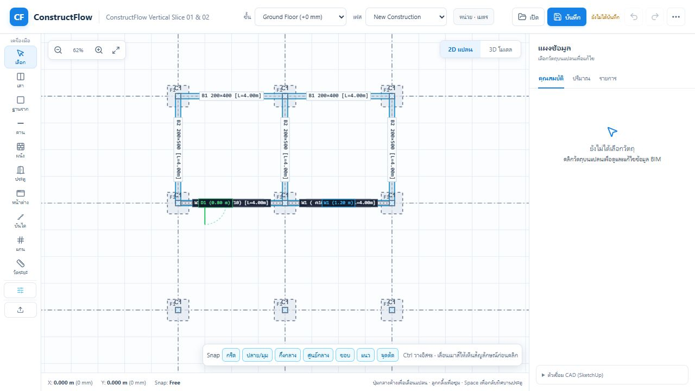

พื้นที่วาดใหญ่ โทนสว่าง และปุ่ม 2D/3D เข้าใจง่าย ควรรักษาไว้ ตัวหนังสือของ rail/status เล็ก ปุ่มคลังมีเพียงไอคอน และแผงขวายังใช้พื้นที่แม้ไม่มีวัตถุที่เลือก ควรให้แผงขวาแสดงค่าของเครื่องมือที่กำลังใช้ หรือยุบได้

### 2. เมนูเพิ่มเติม — ต้องจัดหมวดใหม่

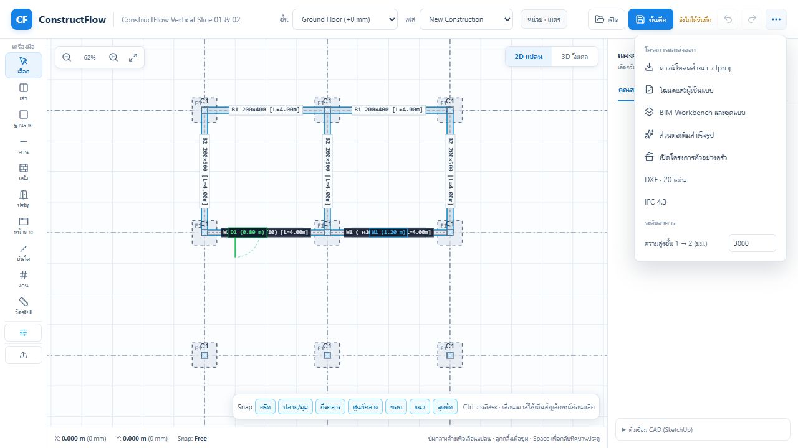

เปิดเมนูเดียวเข้าถึงงานได้หลายอย่าง แต่ไฟล์ ส่งออก Workbench ชิ้นงานสำเร็จรูป โครงการตัวอย่าง และความสูงชั้นอยู่รวมกัน ผู้ใช้ต้องอ่านเพื่อเดาทางเข้า ค่าความสูงชั้นควรอยู่ในตัวจัดการระดับอาคาร และโครงการตัวอย่างควรอยู่ในหน้าเริ่มต้น/ช่วยเหลือ

### 3. เปิดคลังชนิด — ฟอร์มมากกว่าการเลือก

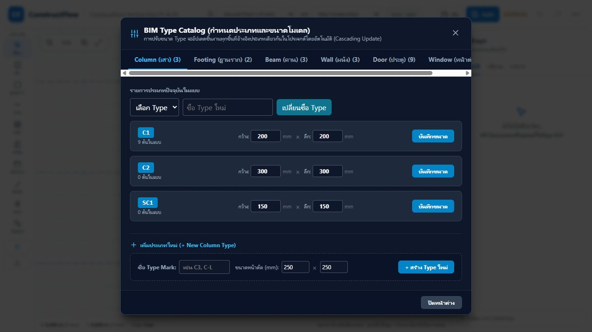

มีจำนวนชิ้นที่ใช้ชนิดนั้น เป็นข้อมูลที่ดีสำหรับการแก้ชนิด แต่ส่วนเปลี่ยนชื่ออยู่ก่อนการเลือก รายการทุกแถวเป็นช่องกรอกและปุ่มบันทึก แท็บหมวดล้นแนวนอน และธีมมืดต่างจากหน้าหลัก ไม่มีช่องค้นหาหรือภาพให้เลือก

### 4. รายการหน้าต่าง — เปรียบเทียบรูปแบบยาก

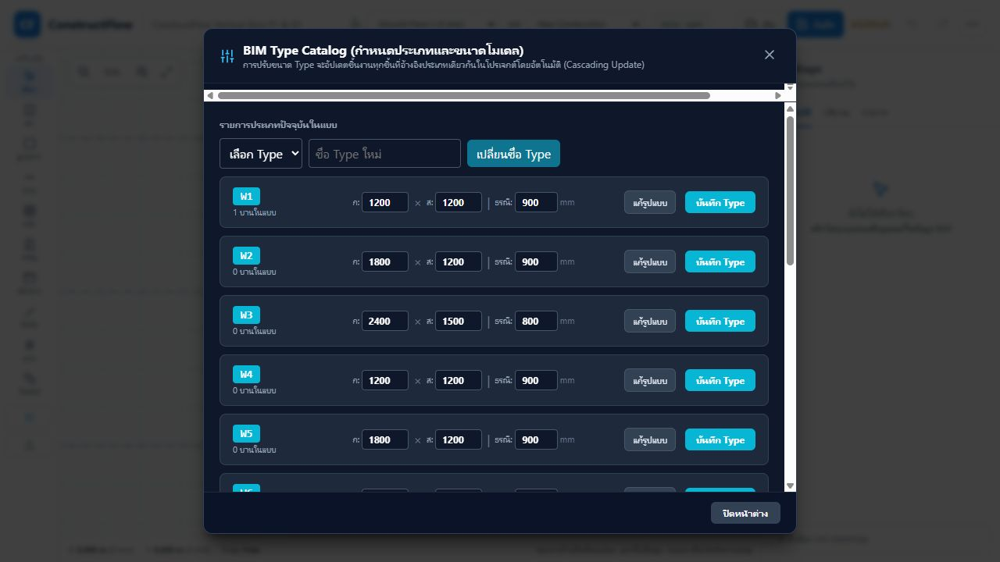

เห็นรหัสและขนาดได้ แต่ W1–W10 ยังไม่มีภาพและชื่อรูปแบบในรายการ ผู้ใช้ต้องเปิดรายละเอียดเพื่อรู้ว่าเป็นบานเลื่อน บานกระทุ้ง หรือมีช่องแสง ปุ่มสร้างใหม่อยู่หลังรายการยาว ควรมี CTA สร้างใหม่ที่มองเห็นเสมอ

### 5. แก้รูปแบบหน้าต่าง — ความสามารถดี แต่พื้นที่แก้ไขแน่น

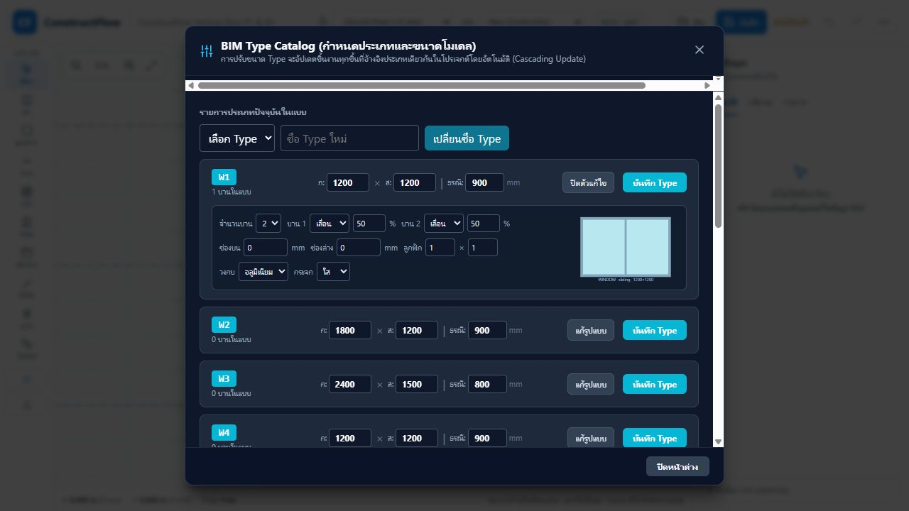

มี preview และตั้งค่าบาน สัดส่วน ช่องแสง ลูกฟัก วงกบ กระจกได้จริง แต่ภาพเล็กและช่องกรอกอัดในแถวเดียว ตัวแก้ไขฝังอยู่ในรายการ ปุ่มบันทึกอยู่เหนือรายละเอียด ไม่มีปุ่มยกเลิกการแก้ไขที่สื่อชัด ควรเปิด editor ที่มุ่งแก้ทีละชนิดและมี action bar คงที่

### 6. BIM Workbench — ต้องแปลงเป็นงานที่ผู้ใช้เข้าใจ

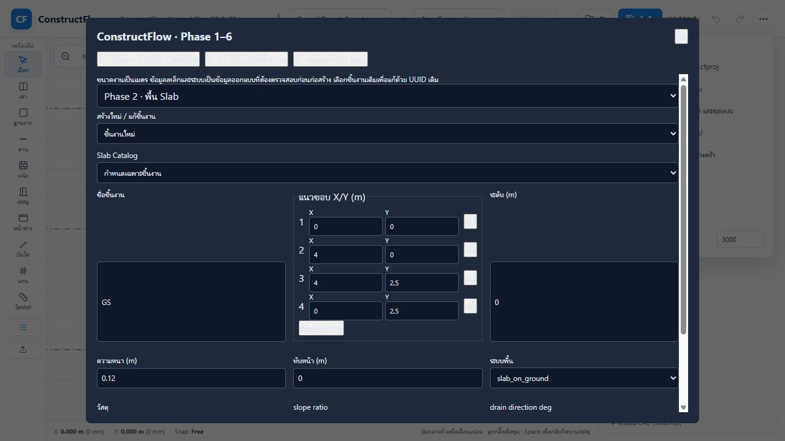

เข้าถึงโดเมนหลายอย่างได้ แต่ชื่อ Phase 1–6 เป็นลำดับพัฒนาระบบ ไม่ใช่งานของผู้ใช้ ฟอร์มมีชื่อระบบดิบ เช่น `slab_on_ground` และ `drain direction deg` ช่อง scalar บางช่องเป็นกล่องข้อความสูงมาก ปุ่มบนพื้นขาวมีข้อความซีดจนอ่านยาก ต้องแก้สีทันทีและเปลี่ยนทางเข้าเป็นหมวดงาน

### 7. คลังคาน/พื้นอีกหน้าหนึ่ง — ทางเข้ากระจัดกระจาย

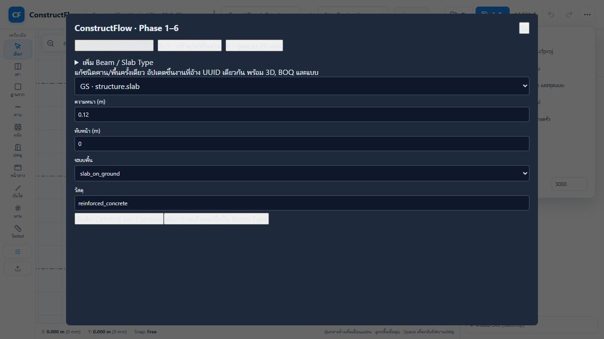

Workbench มี editor คาน/พื้นแยกจาก Type Catalog ผู้ใช้ต้องรู้ว่าแต่ละชนิดอยู่ที่ไหน ชื่อปุ่ม “บันทึก Catalog และ Cascade” และชื่อวัสดุดิบเพิ่มภาระการอ่าน ให้รวม UI ของคลัง และแสดงผลกระทบเป็น “อัปเดตชิ้นงานที่ใช้ชนิดนี้”

### 8. เลือกชนิดก่อนวาด — ทำได้ แต่ควบคุมซ้ำ

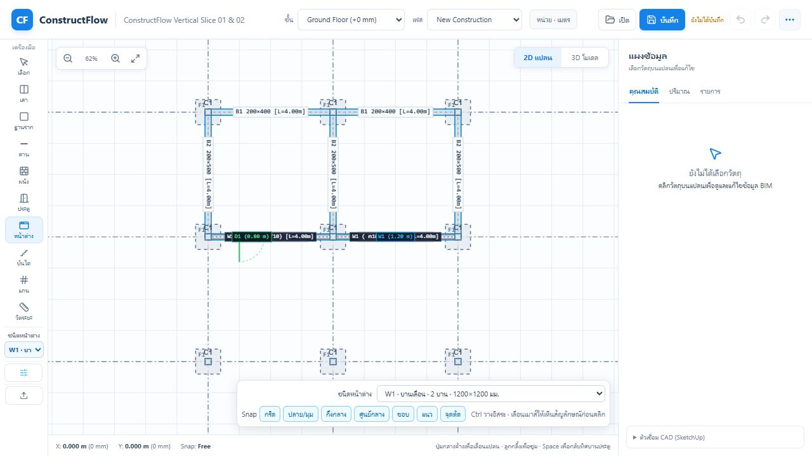

เลือกชนิดก่อนวางได้แล้ว แต่มี dropdown ทั้ง rail แคบและด้านล่าง canvas ตัวแรกตัดชื่อจนอ่านไม่ครบ Snap ทั้งเจ็ดตัวอยู่ตลอดเวลา เสนอ type picker เดียวในแถบเครื่องมือเฉพาะงาน พร้อมภาพย่อ และ Snap สรุปสถานะพร้อมเปิดรายละเอียดได้

### 9. เลือกเสาและอ่านคุณสมบัติ — ควรนำข้อมูลทำงานขึ้นก่อน

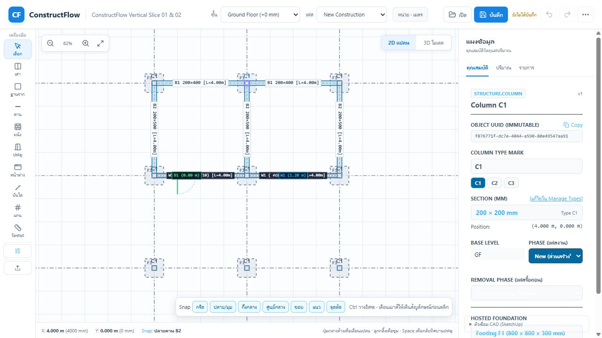

เลือกวัตถุแล้วแสดงข้อมูลทันที มีลิงก์แก้ชนิดและเฟส แต่ UUID/version/ชื่อ object_type มาก่อนค่าที่ใช้ทำงาน มีข้อความภาษาอังกฤษและตัวเลือกบางส่วนซีดบนพื้นสว่าง แยกข้อมูลชิ้นนี้กับข้อมูลชนิด แล้วพับ UUID/version ไว้ใน “ข้อมูลระบบ”

## ปัญหาที่ควรแก้ตามผลกระทบ

| ลำดับ | ปัญหาและหลักฐาน | ผลที่ต้องการ |
|---|---|---|
| P0 | ข้อความและปุ่มซีดใน Workbench/Properties — ภาพ 6, 7, 9 | อ่านได้ทั้งสถานะปกติ เลือก focus และ disabled; ใช้ tokens เดียวกัน |
| P1 | คลังกระจายสองทาง ไม่มีภาพ/ค้นหา — ภาพ 3, 4, 7 | คลังเดียว ค้นหาและเลือกจากรูปได้ เปิดตรงหมวดปัจจุบัน |
| P1 | เลือกชนิดซ้ำและชื่อถูกตัด — ภาพ 8 | picker เดียว ใช้ชนิดที่เห็นตรงกับ preview ขณะวาง |
| P1 | editor อัดข้อมูล ปุ่มบันทึก/ยกเลิกไม่ชัด — ภาพ 5 | draft ทีละชนิด preview ใหญ่ แสดงผลกระทบก่อน apply |
| P1 | เมนูรวมหลายบริบท — ภาพ 2, 6 | แยกไฟล์ งานสร้าง ส่งออก และตั้งค่า |
| P2 | ข้อมูลระบบและศัพท์ภายในเด่นเกินไป — ภาพ 6, 7, 9 | ใช้ชื่อไทยตามงาน รายละเอียดระบบพับไว้ |
| P2 | Snap และ inspector ใช้พื้นที่คงที่ — ภาพ 1, 8 | เปิดตามบริบทและยุบได้ โดยยังเห็นสถานะ snap/reference |

## โครงหน้าจอที่เสนอ

### พื้นที่ทำงาน

- Header: ชื่อโครงการ ชั้น/ระดับ เฟสทำงาน สถานะบันทึก และเมนูไฟล์ ให้เฟสสร้างชิ้นงานต่างจากตัวกรองเฟสมุมมองอย่างชัดเจน
- Rail: เลือก/วาดหลักที่ใช้บ่อย พร้อมชื่อ “คลังชนิด” ที่อ่านได้ กลุ่มงานเพิ่มเติมเปิด flyout ตามโดเมนเมื่อจำเป็น
- แถบเฉพาะเครื่องมือ: **ชนิดพร้อมภาพย่อ / ค่าของชิ้นที่จะวาง / แนวอ้างอิง / เปิดคลัง** ปรากฏเฉพาะเมื่อเลือกเครื่องมือวาด
- Canvas: รักษาแปลนให้กว้าง Snap แสดง “เปิด · BIM” และ target ปัจจุบัน มี popover เลือกชนิด snap และ preset; ใช้ชุดที่เปิดอยู่เดิม ไม่เปลี่ยนพฤติกรรมเงียบ ๆ
- Inspector: เมื่อวาดแสดงค่าของชิ้นถัดไป เมื่อเลือกแสดงข้อมูลชิ้นที่เลือก ผู้ใช้ยุบและเปิดกลับได้
- Space ของผนัง/คานแสดงแนวอ้างอิง “ชิดใน / กึ่งกลาง / ชิดนอก” และ ghost ชัดเจน; ประตูใช้คำแนะนำการกลับทิศตามเครื่องมือ หลีกเลี่ยงข้อความ shortcut ที่ผิดบริบท

### คลังชนิดเดียว

โครง: **หมวดด้านซ้าย → ช่องค้นหา/ตัวกรองด้านบน → การ์ดภาพตรงกลาง → รายละเอียดของการ์ดที่เลือก** เปลี่ยนแท็บแนวนอนเป็นหมวดที่เลื่อนได้ในแนวตั้ง บนจอแคบใช้ dropdown หมวด

การ์ดมีภาพ ชื่อที่เข้าใจง่าย รหัส ขนาด และจำนวนที่ใช้ เช่น “หน้าต่างบานเลื่อน 2 บาน · ช่องแสงบน–ล่าง” / W10 / 1800×1800 มม. ชื่อแสดงผลกับรหัสต้องแยกกันใน UI; ตรวจ catalog metadata ที่มีอยู่ก่อนเพิ่ม schema เพื่อไม่เปลี่ยน UUID หรือความหมายของ mark

ค้นหาได้จากชื่อ รหัส หมวด และคุณสมบัติหลัก มีตัวกรอง “ทั้งหมด / ใช้ในโครงการ / ล่าสุด / รายการโปรด” เก็บล่าสุด/โปรดเป็น preference แยกจากข้อมูลเรขาคณิต

เปิดจากเครื่องมือหน้าต่างต้องเข้าหมวดหน้าต่างและเลือกชนิดปัจจุบัน เปิดจากวัตถุต้องตรงชนิดของวัตถุนั้น มีปุ่ม **เลือกเพื่อวาด**, **ใช้กับชิ้นที่เลือก**, **แก้ไขชนิด**, **สร้างจากชนิดนี้** โดยแสดงเฉพาะ action ที่ตรงบริบท ปุ่มสร้างใหม่อยู่บน toolbar ของคลัง

ระยะแรกรวมเสา ฐานราก คาน ผนัง ประตู หน้าต่าง และพื้นจาก Workbench ส่วนโดเมนอื่นทยอยลง registry เดียวเมื่อมี catalog contract รองรับ

### ตัวแก้ไขชนิด

แก้ทีละชนิด ภาพ 2D ใหญ่เห็นตลอดการแก้ ระยะแรกใช้ preview ที่มีอยู่ ต่อด้วย 3D preview ตาม representation ปัจจุบันเมื่อวงจร edit เสถียร

| ส่วน | เปิดเริ่มต้น | เนื้อหา |
|---|---|---|
| ขนาดและรูปแบบ | เปิด | ชื่อ/รหัส กว้าง สูง วิธีเปิด วงกบ/กระจกที่สำคัญ |
| องค์ประกอบ | เปิดเมื่อรูปแบบต้องใช้ | จำนวนบาน ชนิดและสัดส่วนแต่ละบาน ช่องแสงบน/ล่าง ลูกฟัก |
| วัสดุและรายละเอียด | พับ | วัสดุรายส่วน คุณสมบัติรายละเอียดที่มีจริง |
| ปริมาณและราคา | พับ | ข้อมูลที่ domain รองรับ มีหน่วยและแหล่งค่า |
| ข้อมูลระบบ | พับ | UUID/schema และข้อมูลวิเคราะห์ |

เลือก preset เป็นจุดเริ่มได้ เช่น เลื่อนสองบาน/เลื่อนมีช่องแสงบน–ล่าง/เปิดลูกฟัก แล้วปรับต่อได้ ไม่บังคับให้ไล่ wizard ทุกครั้ง

Footer คงที่: **ยกเลิก / บันทึกชนิด** พร้อมข้อความ “ชนิดนี้ใช้กับ 12 ชิ้น — จะอัปเดตทุกชิ้น” การแก้เฉพาะชิ้นมีทาง “สร้างชนิดใหม่และใช้กับชิ้นนี้” หรือ instance override เฉพาะ field ที่ contract รองรับ ไม่เปลี่ยนความหมายของ Type โดยเงียบ ๆ

Draft แยกจาก project แก้ preview ได้โดยยังไม่ cascade บันทึกผ่าน CommandBus เป็น transaction เดียว Undo คืนได้ Cancel ทิ้ง draft ถ้ามี draft ค้างแล้วจะปิด/สลับชนิด ต้องมีทางกลับแก้ต่อหรือทิ้งการแก้ไข Error อยู่ข้าง field และ focus ไปที่ field แรกที่ผิด รักษาค่าที่ผู้ใช้กรอกเมื่อคำสั่งถูกปฏิเสธ

### แผงคุณสมบัติ

ลำดับเริ่มต้น: **ชื่อวัตถุ → ชนิดพร้อมภาพ/ขนาด → ค่าของชิ้นนี้ → ระดับและตำแหน่ง → เฟส → ส่วนเกี่ยวข้อง** ปุ่ม “แก้ชนิด · ใช้กับ N ชิ้น” เปิด editor ตรงชนิด รหัส UUID และ schema อยู่ใน “ข้อมูลระบบ” ค่าจากชนิดกับ override ต้องแสดงแหล่งค่าและคืนค่าเริ่มต้นได้

### เมนูและการตั้งค่า

| ทางเข้าหลัก | หน้าที่ |
|---|---|
| โครงการ | สร้าง/เปิด/บันทึก ข้อมูลโครงการ ผู้เขียนแบบ |
| สร้าง | เครื่องมือแยกโครงสร้าง สถาปัตย์ ระบบ และชุดส่วนต่อเติมสำเร็จรูป |
| มุมมอง | 2D/3D ตัวกรองเฟส แสดงผล ยุบแผง |
| แบบและส่งออก | ชุดแบบ ตาราง BOQ และ DXF/IFC ที่ใช้งานได้ |
| ตั้งค่า | ตั้งค่าโครงการและโปรแกรมในส่วนที่ระบุขอบเขตชัดเจน |
| ช่วยเหลือ | คีย์ลัด ตัวอย่างโครงการ และคู่มือสั้นตามงาน |

เมนูอาจใช้ปุ่มข้อความ compact/dropdown โดยไม่เพิ่ม ribbon หลายแถว งานสร้างทั่วไปยังเริ่มจาก rail ได้

การตั้งค่าโครงการ: ชั้น/ระดับ หน่วยแสดงผลและความละเอียด ข้อมูล titleblock ค่าเริ่มต้นของโครงการ  
การตั้งค่าโปรแกรม: ธีม/ขนาด UI พฤติกรรม input และ shortcut ที่มีระบบรองรับ  
ค่าของเครื่องมือ: ชนิดที่จะวาง แนวอ้างอิง Snap และค่าชิ้นถัดไปอยู่ใกล้ canvas

แต่ละ setting แสดงขอบเขต “โครงการนี้ / เครื่องนี้ / เครื่องมือปัจจุบัน” การเปลี่ยนหน่วยแสดงผลต้องไม่แปลงค่าจัดเก็บจนผิด เปลี่ยนระดับอาคารที่มี dependents ต้องแสดงผลกระทบตาม contract

Workbench ให้ทยอยเปลี่ยนจากชื่อ Phase และฟอร์ม payload รวมเป็นเครื่องมือชื่อไทย เช่น พื้น หลังคา ท่อ ตู้ แบบและตาราง ป้อนจุดจาก canvas เมื่อ tool รองรับ ส่วนพิกัดตัวเลขยังมีให้แก้แบบละเอียด ช่อง scalar ใช้ input เหมาะสมและ enum มี label ไทย เก็บ payload/diagnostic ในโหมด developer

ตัวเชื่อม SketchUp ที่ยังเห็นในภาพ 1/8/9 และข้อความในเอกสารเก่าต้องนำออกจากทางเดินหลักตามการเปลี่ยนแผน standalone ที่ผู้ใช้แจ้งไว้ งานนี้ไม่เพิ่ม milestone SketchUp ใหม่

## ลำดับพัฒนาและเกณฑ์รับงาน

| ชุดงาน | งานหลัก | เกณฑ์ตรวจรับ |
|---|---|---|
| A — อ่านง่ายและสอดคล้อง | ใช้ light tokens เดิมกับ modal/workbench/inspector; แก้สีปุ่มและข้อความ; label ไทย; field scalar; พับข้อมูลระบบ | ไม่มีตัวหนังสือหายบนพื้นหลัง; ตรวจ contrast ปกติ/selected/focus/disabled; ไม่มี horizontal overflow ที่ 1280×720 |
| B — คลังและ picker | คลังเดียว ภาพ/ค้นหา หมวดแนวตั้ง เลือกตามบริบท; รวมคาน/พื้น; type picker เดียว; recent | เลือกหน้าต่างที่เห็นจาก quick picker ภายใน 3 interactions เป็นเป้าหมาย; เลือกแล้ว ghost/type_id ตรงกัน; ใช้ชนิดเดิมได้หลังเปิดโครงการ |
| C — editor และผลกระทบ | preview ใหญ่ แบ่งส่วน preset draft apply/cancel duplicate-as-new; Type/Instance แยกชัด | Cancel ไม่แก้ project; Apply อัปเดต dependent IDs ตามเดิม; Undo คืนค่า; คำสั่งปฏิเสธยังเห็น draft/error; ไม่มี UUID/phase เปลี่ยนโดยไม่ตั้งใจ |
| D — เมนู/ตั้งค่า/Workbench | เมนูตามงาน Level Manager Settings ที่ระบุ scope; Snap compact; inspector ตามบริบท; แยก Workbench เป็นโดเมนทยอยย้าย | หาไฟล์/ระดับ/ส่งออกได้จากหมวดตรงชื่อ; ไม่มีคำสั่งเดิมหายหลังย้าย; ระดับ/หน่วยไม่บิด geometry; Escape/focus return ทำงาน |

ลำดับแนะนำ **A → B → C → D** ภาพรวมทั้งคลังและเมนูควรตกลงก่อน B แต่ทำเป็นชุดเล็กตรวจใช้งานได้ทีละชุด ไม่รอเปลี่ยนทุกหน้าเสร็จพร้อมกัน

ตัวเลขจำนวน interactions เป็นเป้าหมายเสนอ ยังไม่ได้วัด baseline จับเวลาการใช้งานจริงก่อน/หลังด้วยโครงการเดียวกัน มีหน้าต่างหลายรูปแบบและ Type ที่หลายชิ้นใช้ร่วมกัน

## โครง implementation ที่รองรับ

- ใช้ `app.css` เป็นฐาน shared tokens และสร้าง Button, Field, Dialog, Tabs/CategoryNav, EmptyState, FormSection ที่รองรับ focus/disabled/error ชัดเจน ย้าย inline palette ที่ซ้ำโดยไม่เปลี่ยน domain behavior
- แยก `TypeManagerModal.tsx` เป็น CatalogBrowser, TypeCard, TypeEditor และ editor ราย domain; route/context ระบุ family, type ID และ intent ของการเปิด
- `Toolbar.tsx` และ `PlanCanvas.tsx` ใช้ ToolContextBar/TypePicker เดียว ลดการทำ label และ dropdown ซ้ำ ข้อมูล active type มีเจ้าของ state เดียว
- `ConstructionWorkbench.tsx` ใช้ catalog surface กลาง และ descriptor ระบุ label/unit/control สำหรับ field ให้ enum value ภายในยังคงเดิม
- `PropertiesPanel.tsx` จัดส่วน instance/type ใหม่ ดึงรายการชนิดจริงจาก registry ไม่ใช้ชุด preset ที่ไม่มีใน project
- `App.tsx` จัด orchestration ของ menu/dialog/context เท่านั้น การเลือกชนิด/แก้/clone ผ่านคำสั่งเดิมหรือคำสั่ง typed ที่มี validation ใน domain
- `packages/catalog-engine`, `project-model`, `command-schema/runtime` เป็นเจ้าของ semantics และ validation; `representation-engine` เป็นแหล่ง preview geometry; Snap อยู่ `packages/snapping-engine` ตาม AGENTS.md
- Registry UI ให้เพิ่มหมวดได้โดยไม่คัดลอกฟอร์มทั้งหน้า Draft และสถานะ popover เป็น UI state ไม่เขียนค่าลง project ตลอดการพิมพ์
- Audit นี้ไม่รับรองว่าทุกความสามารถในโดเมนพร้อมแล้ว เมนูใหม่ต้องอิง capability ที่ทำงานได้จริง ไม่สร้างปุ่มที่ยังทำงานไม่ได้

## วิธีตรวจหลัง implementation

1. เลือกหน้าต่างเลื่อนที่มีช่องบน–ล่างก่อนวาด วางลงผนัง ตรวจชนิดและ preview ที่ใช้ตรงกัน
2. เปิดชนิดจากวัตถุที่เลือก แก้ขนาด/องค์ประกอบ ดูจำนวนชิ้นที่จะเปลี่ยน Apply ตรวจ 2D/3D/ปริมาณ แล้ว Undo
3. สร้างชนิดใหม่จากชนิดเดิมและใช้กับชิ้นเดียว ตรวจวัตถุอื่นไม่เปลี่ยนและ UUID ของวัตถุเดิมคงอยู่
4. Cancel/ปิด editor ที่มี draft/แก้ค่าผิด แล้วตรวจ project ไม่ถูกแก้โดยไม่ Apply และ draft ไม่หายจาก rejection
5. เปลี่ยนระดับ/หน่วยแสดงผล ตรวจ reference geometry และเฟส; ตรวจ Snap popup กับ Space ตามเครื่องมือ
6. ใช้ keyboard เปิดคลัง ค้นหา เลือก แก้ บันทึก/ยกเลิก Escape และ focus return; วัด contrast และตรวจ label/errors ด้วย accessibility tooling
7. ตรวจภาพจอ 1280×720 และ 1440×900; viewport เล็กใช้ layout สำรอง ตรวจรายการยาว empty/search-no-results และ scrolling
8. รัน build และ tests ที่เกี่ยวกับ catalog cascade, command transaction, migration, representation และ interaction ที่เปลี่ยนจริง ไม่เพิ่ม tests ที่ตรวจเพียงลักษณะ CSS ตาม implementation

## ผล implementation — 8 ตุลาคม 2026

ภาพ 1–9 ด้านบนเป็นหลักฐานก่อนปรับ; ส่วนนี้บันทึกผลหลังผู้ใช้อนุมัติให้ลงมือ ไม่ถือว่าทุกข้อเสนอในแผนเสร็จทั้งหมด

| ชุดงาน | ทำแล้ว | งานต่อยอดที่ยังเหลือ |
|---|---|---|
| A | modal/inspector/workbench โทนสว่าง, label ไทย, scalar input ขนาดเหมาะสม, shared Dialog/Field | วัด contrast ทุกสถานะและตรวจ screen reader; ยังไม่ได้ย้ายทุก legacy modal มาใช้ Dialog |
| B | คลังเดียว 7 หมวด มีภาพ ขนาด จำนวนที่ใช้ ค้นหา ใช้ในโครงการ ล่าสุด โปรด; เปิดตามเครื่องมือหรือวัตถุ; ตัวเลือกก่อนวาดอยู่จุดเดียว | ขยาย catalog registry ให้โดเมนอื่นเมื่อ contract รองรับ; ชื่อแสดงผลที่ผู้ใช้ตั้งเองแยกจากรหัสยังไม่เพิ่ม schema |
| C | draft editor ทีละชนิด, preview 2D, preset บาน/ช่องแสง/ลูกฟัก, รายละเอียดพับได้, แสดงผลกระทบ, บันทึก transaction เดียว, เตือน draft, clone + assign ชิ้นเดียว | preview 3D ใน editor; mapping error ข้างทุก field; label แหล่งค่า/คืน instance override ยังไม่ครบ |
| D | เมนูแยกตามงาน, ยุบ inspector, Snap settings ยุบได้, ตั้งค่าระดับโครงการเป็นเมตร, Workbench แบ่งกลุ่มงาน/แบบและตาราง, ย้ายคลังพื้นมาใช้คลังเดียว, ถอด SketchUp panel จากทางเดินหลัก | วางพื้น/หลังคา/MEP/ตู้จาก canvas โดยตรง; หน่วย/ธีม/shortcut preferences และแบบทดสอบ usability แบบจับเวลา |

ตั้งค่าแสดงทั้ง base/top level dependents; ความสูงชั้นกับ elevation เป็นค่าที่แก้แยกกันตาม command ปัจจุบัน ปรับ height อย่างเดียวไม่ได้เลื่อน elevation ชั้นบนให้อัตโนมัติ รายการล่าสุด/โปรดเป็น preference ใน browser ไม่แก้ geometry ของ project

### ภาพหลังปรับ

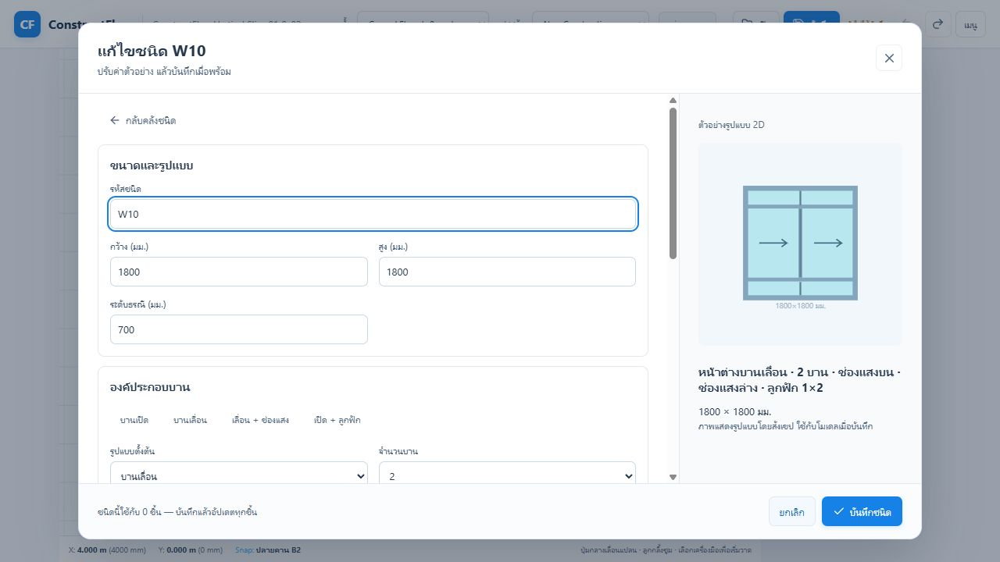

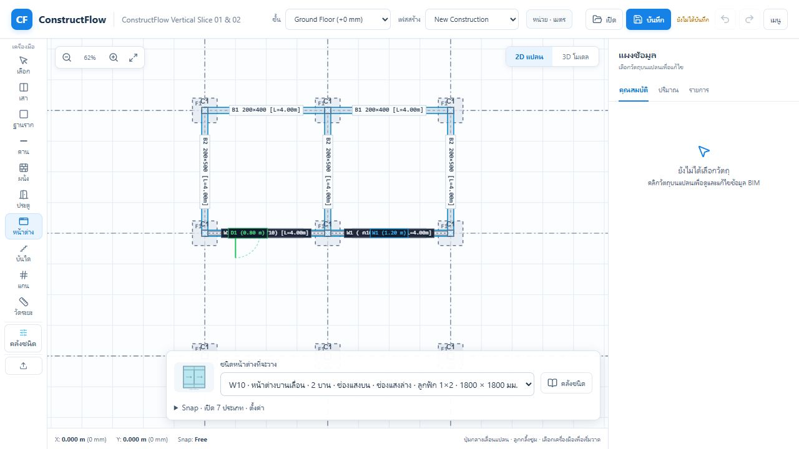

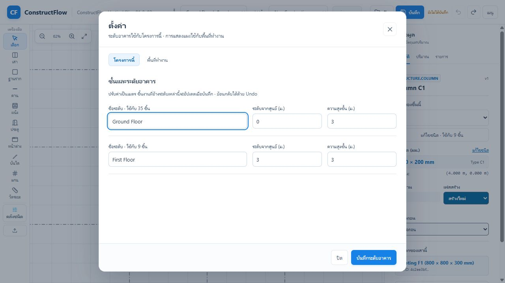

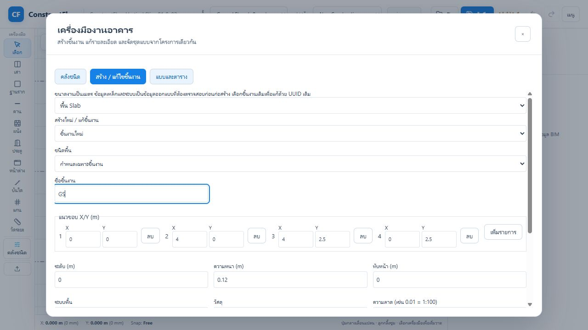

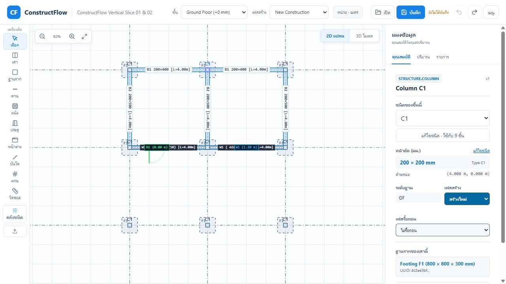

### การตรวจที่ทำจริง

- UI โครงการตัวอย่าง: เลือก W10 ก่อนวาด; เปิด editor ตรงกับวัตถุ; Cancel draft โดยไม่แก้ project; แก้ W1 กว้าง 1200 → 1300 แล้ว Undo → 1200; rename W10 → W10-QA แล้วเลือกเพื่อวาดและ Undo → W10 พร้อมตัวเลือกที่ตรงกัน
- Clone C1 เป็น C1-ใหม่ หน้าตัด 250×200 แล้วใช้กับเสาที่เลือก: ชนิดเดิมเหลือ 8 ชิ้น สำเนาใช้ 1 ชิ้น; Undo ครั้งเดียวคืน C1 ทั้ง 9 ชิ้นและลบชนิดสำเนา
- ค่าช่องแสงที่สูงเกินชนิดถูก domain ปฏิเสธ draft ยังคงอยู่; เปลี่ยน elevation L2 3.0 → 3.2 ม. แล้ว Undo คืน 3.0 ม.; เมนูปิดหลังเปิดหน้าต่าง
- Tab จากปุ่มบันทึกวนไปปุ่มปิดภายใน dialog; ปิดตั้งค่าคืน focus ให้เมนู; ช่องแสงสูงเกินแสดงข้อความไทยและ focus ไป field ช่องแสงโดยเก็บ draft
- ตรวจภาพ desktop 1280×720 และ editor ที่ viewport 760×800: dialog ไม่มี horizontal overflow; ยังไม่ได้ตรวจ interaction ครบทุกเครื่องมือที่จอเล็กหรือ screen reader
- `npm run build` ใน `apps/plan-editor`: ผ่าน TypeScript และ Vite production build (ยังมีคำเตือน chunk >500 kB ของ bundle ใหญ่)
- `npm test` ใน `packages/command-runtime`: ผ่าน 42 tests รวม 3 tests ใหม่สำหรับ atomic rename/update, rollback และ clone/assign/Undo
- `git diff --check`: ผ่าน; งานนี้ไม่แก้ domain schema, UUID หรือกฎ created_phase; ทุก project mutation ใช้ CommandBus เดิม ไม่มีการเพิ่ม geometry/quantity formula ใน UI

### ไฟล์ของงาน UX ชุดนี้

สร้าง:

- `apps/plan-editor/src/components/ui/Dialog.tsx`
- `apps/plan-editor/src/components/catalogPresentation.tsx`
- `apps/plan-editor/src/components/CatalogField.tsx`
- `apps/plan-editor/src/components/TypePicker.tsx`
- `apps/plan-editor/src/components/SettingsModal.tsx`
- `packages/command-runtime/test/catalog-edit-transaction.test.mjs`

แก้ไข/ต่อยอด:

- `apps/plan-editor/src/app.css`
- `apps/plan-editor/src/App.tsx`
- `apps/plan-editor/src/components/TypeManagerModal.tsx`
- `apps/plan-editor/src/components/Toolbar.tsx`
- `apps/plan-editor/src/components/PlanCanvas.tsx`
- `apps/plan-editor/src/components/PropertiesPanel.tsx`
- `apps/plan-editor/src/components/ConstructionWorkbench.tsx`
- `apps/plan-editor/src/components/ProjectLegalModal.tsx`
- `apps/plan-editor/src/components/ExtensionPresetsModal.tsx`
- `apps/plan-editor/src/components/UnderlayCalibrationModal.tsx`
- `docs/UX-CATALOG-MENUS-PLAN-2026-10-08.md`
- `docs/STATUS.md`
- `docs/architecture/UI-UX-SPEC.md`
- `docs/assets/ux-catalog-audit-2026-10-08/10-new-catalog.png` ถึง `15-properties.png`

ไฟล์อื่นที่ค้างใน working tree มาจากงานก่อนหน้า ไม่ได้รวมเป็นผลเปลี่ยนแปลงของ UX ชุดนี้ ขั้นถัดไปที่เหมาะสมคือ preview 3D ในตัวแก้ไขชนิด แล้วเพิ่มการวางพื้น/หลังคาจาก canvas โดยใช้ command contract ที่มีอยู่

## Follow-up fix — ultrawide และสัญลักษณ์ช่องเปิด

ผู้ใช้แจ้งแถบเลือกประตู/หน้าต่างหลุดขอบล่างบนจอ ultrawide และสัญลักษณ์บานเปิด/กระทุ้งอ่านผิดรูปแบบ ตรวจซ้ำก่อนแก้ที่ viewport 2548×913 พบ drawing container สูง 1505 px, bottom 1567 px และแถบเลือกชนิด bottom 1555 px จึงถูกตัดออกจากจอ

แก้ flex drawing stage ให้มี `min-height: 0` และให้ canvas อยู่ในขอบ stage โดยไม่ใช้ขนาด bitmap เป็น intrinsic minimum; ใช้ ResizeObserver เพื่อปรับ bitmap เมื่อขนาดพื้นที่เปลี่ยนทั้งจาก resize จอและยุบ inspector แถบชนิดจำกัดความกว้าง/สูงตามพื้นที่วาดและ selector ย่อได้เมื่อชื่อยาว

Preview ช่องเปิดเป็นรูปด้าน: บานกระทุ้งใช้เส้นประเต็มบานมาบรรจบด้านบน; บานเปิดใช้เส้นประเต็มบานมาบรรจบด้านข้างซ้าย/ขวา แทนเส้นโค้งมุมเล็กแบบแปลน ภาพเป็นสัญลักษณ์ประกอบชนิด ไม่กำหนด instance handing หรือเปลี่ยนกลไกช่องเปิดของโมเดล

| ตรวจหลังแก้ | ผล |
|---|---|
| 2548×913 | stage 2166×817; controls bottom 867; footer bottom 913 |
| 3840×1080 | stage/bitmap 3458×984; แถบชนิด ชื่อยาว W10 และ footer อยู่ในจอ |
| 1280×720 | stage/bitmap 898×624; แถบชนิดและ footer อยู่ในจอ |
| 1280×600 | stage/bitmap 898×504; แถบชนิดและ footer อยู่ในจอ |
| ยุบ inspector ที่ 1280×600 | canvas display/bitmap เปลี่ยนตรงกันเป็น 1204×504 โดยไม่ต้อง resize window |
| สัญลักษณ์ W2/W6 | ตรวจภาพหน้าคลังจริงและไฟล์ภาพที่บันทึกแล้ว |
| `npm run build` ใน `apps/plan-editor` | ผ่าน TypeScript/Vite; คำเตือน bundle >500 kB เดิมยังอยู่ |

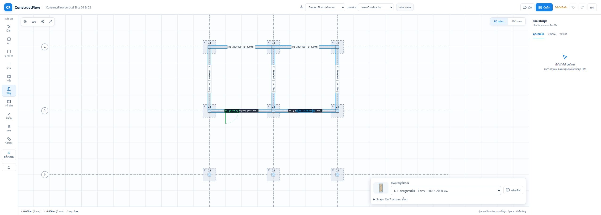

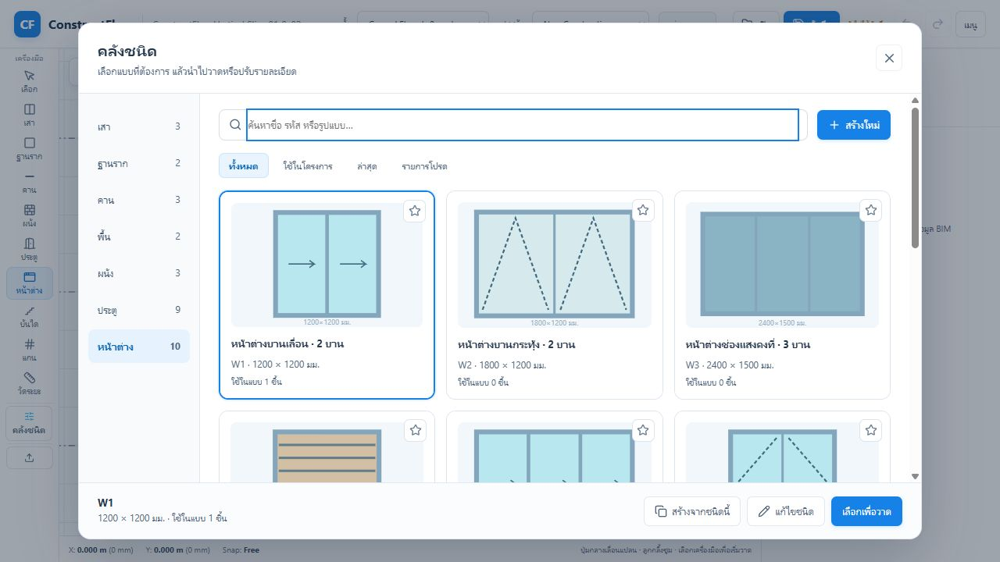

ไฟล์แก้ไขใน follow-up นี้: `apps/plan-editor/src/App.tsx`, `apps/plan-editor/src/app.css`, `apps/plan-editor/src/components/PlanCanvas.tsx`, `apps/plan-editor/src/components/catalogPresentation.tsx` และเอกสารนี้ งานนี้เป็น layout/preview presentation ไม่แก้ `types.ts`, `command-schema`, UUID, created_phase หรือ geometry domain; ตรวจด้วย browser layout และ production build โดยไม่ได้รัน domain test suite ใหม่

## Follow-up fix — ลูกฟักรายบานและช่องแสงแยกส่วน

แก้ความไม่ตรงกันระหว่าง UI, preview และ 3D: UI เดิมใช้คำว่าลูกฟัก แต่ค่า `muntin_rows/columns` นับช่อง ไม่ใช่เส้น; preview แบ่งทั้งชุดข้ามกรอบบาน และช่องแสงบน/ล่างใช้ค่าเดียวกับบานหลัก

- UI ใหม่ป้อน **จำนวนเส้นภายใน 0–7 เส้น**: แนวตั้ง 1 เส้น = เส้นกลางของแต่ละบาน; สไลด์ 2 บานจึงมี 2 เส้นแยกจากเสากลางชุด ไม่รวมวงกบ/กรอบบานเป็นลูกฟัก
- แยก 3 ส่วน: ตัวบาน (จำนวนเส้นต่อบาน), ช่องแสงบน (ทั้งช่อง), ช่องแสงล่าง (ทั้งช่อง) เปลี่ยนส่วนหนึ่งไม่คัดลอกจำนวนไปอีกส่วน
- ช่องแสงเป็น pane ต่อเนื่องทั้งช่องใน representation ปัจจุบัน ไม่แบ่งตามจำนวนบานเคลื่อนที่โดยอัตโนมัติ ตั้งจำนวนเส้นแนวตั้งในช่องแสงเองเพื่อจัดแนวกับบานได้
- คำนวณตำแหน่ง normalized ภายใน pane ด้วย helper ใน architecture-engine ที่ preview และ 3D ใช้ร่วมกัน ตัวบานใช้ grid ภายในแต่ละบานตามสัดส่วนกว้าง ไม่สร้าง grid รวมทั้ง opening
- 3D วางลูกฟักในช่วงกระจกที่หัก rail แล้ว และใช้ grid ของช่องแสงตรงส่วนของมัน
- `.cfproj` ยังคงเก็บ **จำนวนช่อง** เพื่อรักษาความหมายไฟล์เดิม: UI เส้น N บันทึกช่อง N+1; `muntin_rows/columns` เดิมมีผลเฉพาะบานหลัก ช่องแสงที่ไม่เคยมีค่าตั้งแยกเริ่มที่ 0 เส้น ไม่มีการสืบค่าจากบานหลักอีก

ขยาย optional catalog/command/serialization fields: `transom_muntin_rows`, `transom_muntin_columns`, `bottom_light_muntin_rows`, `bottom_light_muntin_columns` จำนวนช่องต้องเป็นจำนวนเต็ม 1–8 ค่าผิด rollback ผ่าน command runtime; UUID, phasing, type/instance separation และ Undo transaction เดิมยังคงอยู่

### ผลตรวจ

- UI W10: บานหลัก นอน 1/ตั้ง 1, ช่องแสงบน นอน 0/ตั้ง 3, ช่องแสงล่าง นอน 1/ตั้ง 0 ภาพแสดงเส้นกลางแยก 2 บาน ตรวจ DOM พบเส้นตั้ง x=58.5 และ x=101.5 ใน preview แทนเส้นรวมกลางทั้งชุด
- บันทึกแล้ว assign W10 ให้หน้าต่างในโครงการตัวอย่าง เปิด 3D ได้และตรวจภาพการแบ่งทั้งสามส่วน; browser console ไม่พบ error
- Tests: project-model **14/14**, architecture-engine **7/7**, representation-engine **7/7**, command-runtime **44/44** รวม **72/72**; เพิ่ม 4 regression cases ครอบคลุมบานกว้างไม่เท่ากัน, grid แยกส่วน, cascade/save/reopen/Undo และ invalid-value rollback
- Build project-model, command-schema, architecture-engine, catalog-engine, representation-engine และ `npm run build` ใน plan-editor ผ่าน (Vite bundle size warning เดิมยังอยู่)

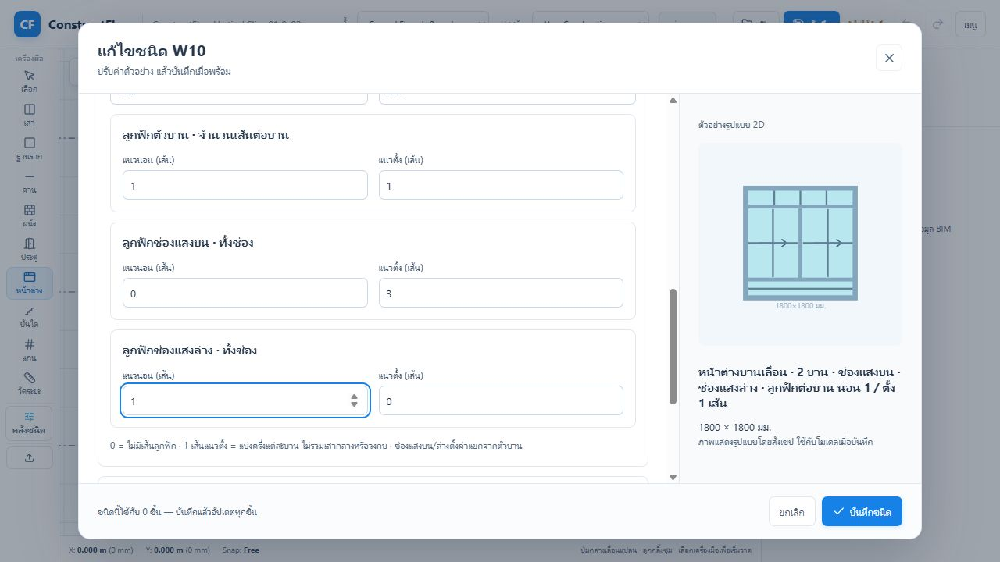

ไฟล์ของ follow-up นี้:

- สร้าง `packages/architecture-engine/src/openingMuntins.ts`, `packages/architecture-engine/test/opening-muntins.test.mjs`, `packages/command-runtime/test/opening-muntin-zones.test.mjs`
- แก้ `packages/architecture-engine/src/index.ts`, `packages/project-model/src/project.ts`, `packages/project-model/src/migrations.ts`, `packages/command-schema/src/structureCommands.ts`, `packages/catalog-engine/src/index.ts`, `packages/representation-engine/src/index.ts`
- แก้ `apps/plan-editor/src/components/TypeManagerModal.tsx`, `apps/plan-editor/src/components/catalogPresentation.tsx`, `apps/plan-editor/src/components/Model3DViewport.tsx`, เอกสารนี้ และภาพ `18-muntin-zones-editor.png`

ยังไม่รองรับจำนวนลูกฟักต่างกันรายบานภายในชนิดเดียว หรือระยะลูกฟักที่กำหนดเองไม่เท่ากัน; ค่าปัจจุบันแบ่งเท่ากันภายในแต่ละ pane งานถัดไปของ editor ยังเป็น preview 3D ตามแผนเดิม

## Follow-up proposal — วัสดุและสเปกกระจกที่ใช้ร่วมกัน

ตรวจจากโค้ดพบว่า “บานเรียบ” ปนกับวัสดุ, ตัวเลือกบานขาด uPVC, กระจกยังไม่มีข้อมูลการผลิต/ความหนา/ชั้นประกอบ และไม่มีสเปกแยกบานกับช่องแสง จึงเพิ่ม [Material & Glass Specification UX Plan](GLASS-MATERIALS-UX-PLAN-2026-10-08.md) ครอบคลุมวงกบ/กรอบบาน/ส่วนบาน, กระจกธรรมดา/เทมเปอร์/ลามิเนต/เทมเปอร์ลามิเนต, สี/ผิว, reuse กับราวและงานกระจกอื่น, migration, 3D และ takeoff

**สถานะเป็นแผน ยังไม่ได้ implement** ลำดับถัดไป A: shared contract + conditional material form, B: วัสดุแยกส่วน + representation, C: ราวและตารางกระจก, D: mixed/per-leaf/งานกระจกอื่น รายละเอียดและเกณฑ์ตรวจในเอกสารแยก; ข้อเสนอใหม่นี้ไม่เปลี่ยนผลทดสอบของงานลูกฟักที่จบแล้ว

## Follow-up — เลือกลายหน้าบาน มือจับ และสีอุปกรณ์

เพิ่มตัวเลือกใน type catalog แยกจากจำนวนลูกฟักและวัสดุ ได้แก่ หน้าบานเรียบ/ลูกฟัก 2, 4, 6 ช่อง/เซาะร่องแนวนอน/แนวตั้ง/เกล็ด; มือจับก้านโยก, ลูกบิด, ก้านดึง, มือจับฝัง; และผิวเงิน, ดำด้าน, ทองเหลืองซาติน, บรอนซ์ พร้อมแสดงใน 2D/3D โดยค่าทั้งหมด optional เพื่อไม่เปลี่ยนชนิดเดิมเมื่อเปิดโครงการเก่า รายละเอียดขอบเขตและสิ่งที่ยังต้องทำสำหรับ production hardware อยู่ใน [Opening Builder UX Plan](OPENING-BUILDER-UX-PLAN-2026-10-08.md#8-รูปแบบหน้าบานและฮาร์ดแวร์ที่เลือกได้)

เลือกชุดตัวอย่างจากรูปแบบที่พบในตลาดไทย เช่น [HDF เซาะร่อง](https://www.homepro.co.th/p/1242154), [HDF ลูกฟัก 4 ช่อง](https://www.homepro.co.th/p/1086231), [มือจับก้านโยก](https://www.homepro.co.th/p/264735?lang=th) และ [มือจับบานเลื่อน](https://www.homepro.co.th/p/271556); ค่าในโปรแกรมยังเป็นรูปแบบแสดงผล ไม่อ้างว่าเป็นสินค้ารุ่น/ขนาดผลิตจริง

## Follow-up fix & plan — Opening builder และ dimension ใน editor

อ่าน workflow จาก Graphisoft Archicad 29 INT Library และตรวจปุ่มเดิมที่ทับช่องแสง/ลูกฟักพร้อมเปลี่ยนวิธีเปิด ปรับ selector เป็น “วิธีเปิดทุกบาน”, เอาปุ่มลัดที่ล้างส่วนเสริมออก, ยุบรายละเอียดรายบาน, เพิ่ม click/Enter/Space เลือกส่วนในรูป และ dimension กว้าง/สูงรวม/ส่วนบาน/ช่องบน/ช่องล่าง ด้วย domain helper

[Opening Builder UX Plan](OPENING-BUILDER-UX-PLAN-2026-10-08.md) ระบุ sources, สิ่งที่ทำแล้ว, การวัดแบบรวมกรอบ, ผลตรวจ และงานที่ยังขาด เช่น ช่องแสงเปิดกระทุ้ง/เลื่อนได้, ช่องข้าง, per-leaf grid/material, height lock และ dimensions แบบผลิต/sheets

architecture-engine tests **9/9** และ plan-editor build ผ่าน; browser ตรวจ D9/W10, mixed save/reopen, invalid height, click/key selection, ultrawide/จอเตี้ย ภาพตรวจไฟล์เต็มที่ `assets/ux-catalog-audit-2026-10-08/20-opening-dimensions-editor.jpg` รอบนี้ยังใช้ schema/commands เดิม รักษา UUID/phasing/transaction; **วัสดุกระจกยังเป็นแผนตามหัวข้อก่อนหน้า และ dimension รอบนี้อยู่ใน editor เท่านั้น**

## Follow-up — แกลเลอรีแบบประตูหน้าต่าง

เพิ่มแท็บ **แบบสำเร็จรูป · เลือกสไตล์** ในหมวดประตูและหน้าต่าง: 16 แบบตั้งต้น พร้อมค้นหาและกรองโมเดิร์น/คลาสสิก/อบอุ่นลายไม้/ใช้งานทั่วไป เลือกแล้วเปิด draft สร้างชนิดใหม่ด้วย UUID ใหม่ผ่าน transaction เดิม ไม่เขียนทับชนิดที่ใช้อยู่ สีวัสดุ preview และโมเดลใช้ข้อมูลร่วมกัน พร้อมรายละเอียดลูกฟักและขอบกระจก 3D ผลตรวจและขอบเขตใน [Opening Builder UX Plan](OPENING-BUILDER-UX-PLAN-2026-10-08.md#9-delivery--แกลเลอรีแบบและรายละเอียดโมเดล-2026-10-08)

## Follow-up — ระบบสร้างลายหน้าบานจาก component recipes

ใน editor ของประตู เพิ่มส่วน “ชุดลายประกอบหน้าบาน” พร้อม 12 recipes: ร่องนอน/ตั้ง, ลายผสม, ลูกฟักหลายช่อง, โค้ง, แคปซูล, วงรี และวงกลม เลือกแล้วเขียนค่า normalized components ลง draft เดิม; 2D preview และ 3D representation ใช้ชุดเดียวกัน. มือจับ 3D เพิ่ม rose/ฐาน, คอ, lock cylinder และจุดยึดตามชนิดมือจับ. ค่าเหล่านี้เป็น design detail และยังไม่ใช่ vendor SKU/รูเจาะผลิต.
